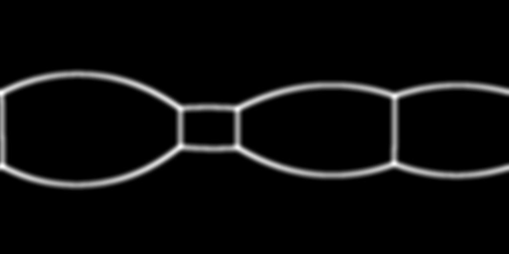
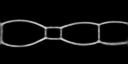

# 基本信息

**发布者（Publisher）：Huawei**

**应用领域（Application Domain）：Computer Vision**

**版本（Version）：1.1**

**修改时间（Modified）：2022.04.11**	

**框架（Framework）：Tensorflow 1.15.0**

**模型格式（Model Format）：ckpt/pb/om**

**处理器（Processor）：昇腾310**

**应用级别（Categories）：Research**

**描述（Description）：基于Tensorflow框架对360°全景图片实现3D布局恢复的离线推理代码**

# 模型概述

CFL模型是CFL: End-to-End Layout Recovery from 360 Images论文的Tensorflow实现，该论文的核心思想是使用StdConvs模型和EquiConvs模型分别在360°全景图片上实现3D布局恢复，并生成边图和角图。需要注意的是，此脚本是使用了StdConvs模型。

- 参考论文

  [Corners for Layout: End-to-End Layout Recovery from 360 Images (cfernandezlab.github.io)](https://cfernandezlab.github.io/CFL/)

- 参考实现

  [GitHub - cfernandezlab/CFL: Tensorflow implementation of our end-to-end model to recover 3D layouts. Also with equirectangular convolutions!](https://github.com/cfernandezlab/CFL)

# 默认配置

- 测试数据预处理（以SUN360测试集为例，仅作为用户参考示例）
  - 图像的输入尺寸：128×256
  - 图像的输入格式：jpg

# 环境准备

- python 3.7
- CUDA 10.0
- cuDNN 7.5				
- python依赖：`pip install -r requirements.txt`

# 数据准备

离线推理之前的数据准备工作：离线推理工作使用SUN360数据集和CFL模型训练得到的ckpt文件（见参考实现），数据集和ckpt文件请用户自行获取，并将ckpt文件重命名为model.ckpt。

# 离线推理

##### 模型固化

执行get_pb.py文件，将model.ckpt固化为cflnet.pb（路径需根据实际情况修改）：

`python get_pb.py --dataset=./data/test --weights=./data/StdConvs/model.ckpt`

get_pb.py的工作逻辑为：

- 定义输入节点：input
- 定义输出节点：edge-estimator/output_likelihood/edge-estimator/output_likelihood
- 调用网络模型生成推理图
- 使用tf.train.writegraph将上述推理图保存成model.pb
- 使用freeze_graph将tf.train.writegraph生成的model.pb与model.ckpt文件合并，生成用于推理的pb图文件：cflnet.pb

##### 模型转换

使用ATC工具，将cflnet.pb转换为tf_cfl.om文件。

- 工具：请按照[ATC工具使用环境搭建](https://gitee.com/link?target=https%3A%2F%2Fsupport.huaweicloud.com%2Fatctool-cann502alpha3infer%2Fatlasatc_16_0004.html)搭建运行环境。

- 命令：`atc --model=./CFL/cflnet.pb --framework=3 --output=./CFL/tf_cfl --soc_version=Ascend310   --input_shape="input:1,128,256,3"`

- 参数：

  ```
  --model             pb模型文件
  --framework         源pb模型使用的框架 
  --output            生成.om文件的路径及名称
  --soc_version       使用的芯片类型
  --input_shape       输入的形状（batch_size,height,width,channel）
  ```

##### 离线推理

- 工具准备

  请参考[https://gitee.com/ascend/tools/tree/master/msame](https://gitee.com/ascend/tools/tree/master/msame)，编译出msame推理工具。

- 数据处理

  通过调用jpg2bin.py文件（路径需根据实际情况修改），将模型测试集中的第一张p1.jpg图片文件转换为p1b.bin文件。

  `python jpg2bin.py --dataset=./data/test ==weights=./data/StdConvs/model.ckpt` 

  下面展示的分别是p1.jpg原图及其边图、角图的ground truth。

  

  <center class="half">
  
  
  </center>

- 执行命令

  在编译好的msame工具目录下执行以下命令，会生成预测出的tf_cfl_output_0.bin文件。

  `./msame --model "/root/CFL/tf_cfl.om" --input "/root/CFL/data/p1b.bin" --output "/root/CFL/result" --outfmt BIN --loop 1`

- 结果评估

  - 为了检查评估离线推理的效果，需要将tf_cfl_output_0.bin转换成.jpg文件，通过执行bin2jpg.py文件实现（路径需根据实际情况修改）。

    `python bin2jpg.py --dataset=./data/test --weights=./data/StdConvs/model.ckpt`

    下面展示的是边图和角图的预测结果。

    <center class="half">
    
    
    </center>

  - 生成图片之后，调用evaluate.py文件，对结果进行精度评估（路径需根据实际情况修改）。

    `python evaluate.py --dataset=./data/test --weights=./data/StdConvs/model.ckpt`

    | 指标 |  IoU  | Accuracy | Precision | Recall | f1 score |
    | :--: | :---: | :------: | :-------: | :----: | :------: |
    | 均值 | 0.589 |  0.963   |   0.919   | 0.628  |  0.741   |

- 中间文件

  离线推理过程生成的中间文件可在百度网盘获取https://pan.baidu.com/s/1TSK8yJLm32jhE1SBbcPDvQ，提取码：14uq

  百度网盘文件夹中文件结构如下图所示：

  ```python
  |--离线推理                              //离线推理过程生成的中间文件
       |--result
            |--20220311_233232
                 |--tf_cfl_output_0.bin  //离线推理预测出的.bin文件
       |--data
            |--p1b.bin                   //将图片转换成的.bin文件
       |--tf_cfl.om                      //使用ATC工具,将cflnet.pb转换为tf_cfl.om文件
       |--cflnet.pb                      //运行get_pb.py文件生成的cflnet.pb
      
  ```

# 文件说明

```python
|--Image                      //存放图片
     |--p1.jpg
     |--p1_CM.jpg
     |--p1_CM_test.jpg
     |--p1_EM.jpg
     |--p1_EM_test.jpg
|--Models                     //模型
 	 |--__init__.py                //网络初始化
     |--CFL_StdConvs.py            //网络构建
     |--network.py                 //网络结构
|--License                    //声明
|--README.md                  //代码说明文档
|--bin2jpg.py                 //.bin文件转.jpg文件
|--config.py                  //参数设置文件
|--evaluate.py                //评估推理结果
|--get_pb.py                  //模型固化
|--jpg2bin.py                 //.jpg文件转.bin
|--p1b.bin                    //p1.jpg生成的.bin文件
|--tf_cfl_output_0.bin        //离线推理预测生成的.bin文件
|--p1_EM_test.jpg             //离线推理预测生成的.bin文件生成的.jpg,边图
|--p1_CM_test.jpg             //离线推理预测生成的.bin文件生成的.jpg,角图
|--p1_EM.jpg                  //测试图片的ground_truth,边图
|--p1_CM.jpg                  //测试图片的ground_truth,角图
|--modelzoo_level.txt         //离线推理进度
|--requirements.txt           //python依赖列表
|--pb_model                   //存放pb模型
     |--model.pb
     |--cflnet.pb
|--data                       //数据集和ckpt文件存放路径
    |--StdConvs                    //ckpt文件
         |--model.ckpt
    |--test                        //数据集
         |--CM_gt
              |--p1_CM.jpg
         |--EM_gt
              |--p1_EM.jpg
         |--RGB
              |--p1.jpg
```