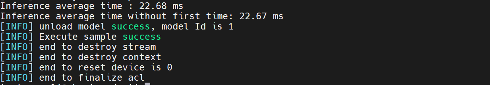
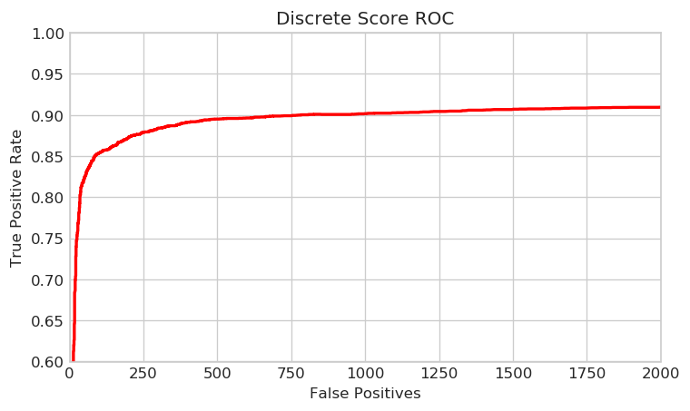

## 1、原始模型
运行ck2pb.py将训练好的ckpt模型转换为pb模型，这里提供已经转化好的pb模型

## 2、转om模型

atc转换命令参考：

```sh
atc --model=./faceboxes.pb --framework=3 --output=./faceboxes_base310 --soc_version=Ascend310         --input_shape="image_tensor:1,1024,1024,3"         --log=info          --out_nodes="nms/map/TensorArrayStack/TensorArrayGatherV3:0;nms/map/TensorArrayStack_1/TensorArrayGatherV3:0;nms/map/TensorArrayStack_2/TensorArrayGatherV3:0"
```


## 3、编译msame推理工具
参考https://gitee.com/ascend/tools/tree/master/msame, 编译出msame推理工具


## 4、数据集准备


### 4.1 执行推理和精度计算

  
执行命令 
```sh
./msame --model "/home/test_user04/model_base310.om" --input "/home/test_user04/inference_data" --output "/home/test_user04/" --outfmt TXT  --outputSize "10000,10000,10000"
```

最后执行python3  inference.py 
得到最后推理精度\

## 5、精度




## 6、性能

