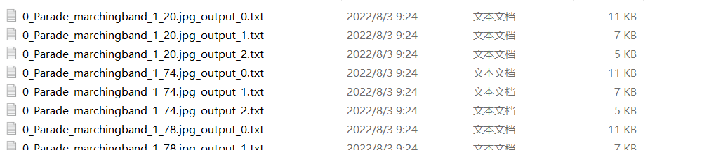

## 1、原始模型
运行ck2pb.py将训练好的ckpt模型转换为pb模型，其中modelfile用于指定ckpt模型的位置

## 2、转om模型

atc转换命令参考：

```sh
atc --model=./faceboxes.pb --framework=3 --output=./faceboxes_base310 --soc_version=Ascend310         --input_shape="image_tensor:1,1024,1024,3"         --log=info          --out_nodes="nms/map/TensorArrayStack/TensorArrayGatherV3:0;nms/map/TensorArrayStack_1/TensorArrayGatherV3:0;nms/map/TensorArrayStack_2/TensorArrayGatherV3:0"
```


## 3、编译msame推理工具
参考https://gitee.com/ascend/tools/tree/master/msame, 编译出msame推理工具


## 4、数据集准备
测试使用的是[FDDB数据集](http://vis-www.cs.umass.edu/fddb/index.html#download)，将数据集下载后解压

运行img2bin.py将FDDB数据库中的图片转换为bin文件，需要自行调整文件路径。

运行createellipselist.py生成ellipseList.txt和faceList.txt，需要自行调整文件路径。


## 5、执行推理

  
执行命令 
```sh
./msame --model "/home/test_user04/model_base310.om" --input "/home/test_user04/inference_data" --output "/home/test_user04/" --outfmt TXT  --outputSize "10000,10000,10000"
```
将会生成如下形式的文件：




## 5、性能


## 6、精度计算
运行.py 将推理生成的*_output.txt文件生成为detections.txt文件

精度计算使用[FDDB数据库的精度计算工具evaluation](http://vis-www.cs.umass.edu/fddb/results.html)，其中要求opencv版本为3.2，在使用make生成evaluation运行文件时，需要手动修改一些evaluation文件的参数，详见[连接](http://vis-www.cs.umass.edu/fddb/faq.html)中的QA最后两项

执行如下命令进行精度计算，其中result/images/为数据集图片所在文件夹,命令会生成DiscROC.txt,运行plot_roc.py可以绘制roc图,roc如图所示，roc=0.96与论文中相同
```sh
./evaluate -a result/ellipseList.txt -d result/detections.txt -i result/images/ -l result/faceList.txt -z .jpg -f 0
```


