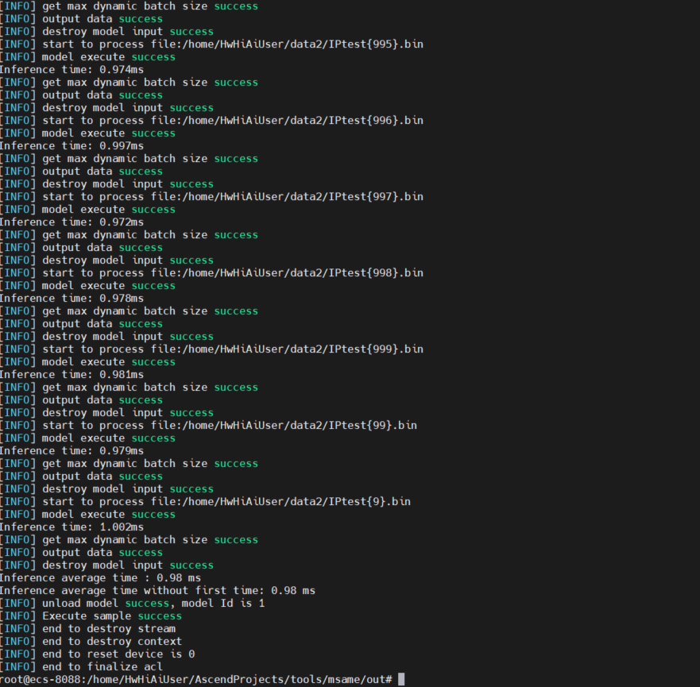

## HybridSN

HybridSN推理部分实现如下

## 训练环境

1）TensorFlow 1.15.0

2）Python3.7.0

## 代码及路径解释

```
HybridSN_ID1160_for_ACL
|---h52pb.py         h5模型固化为pb
|---atc.sh           atc工具  pb转om转换命令
|---msame.sh         msame工具：om离线推理命令
|---offline.py       离线推理
```

## 数据处理过程

推理数据预处理在训练中进行保存，具体见HybridSN_ID1160_for_TensorFlow增加数据处理代码

## 模型文件

初始h5， 固化pb，以及推理om文件链接： 链接：https://pan.baidu.com/s/1QK0r_GtbKIQDEiVRM4SKLw 
提取码：xi7o

## ATC工具进行模型转换时可参考atc.sh

```
atc --model=/usr/hy.pb --framework=3 --output=/usr/l3 --soc_version=Ascend310 --out_nodes="Identity:0" --input_shape="input_1:1, 25, 25, 30, 1"
```

## msame工具进行推理时可参考msame.sh

```
./msame --model "/usr/l3.om" --input "/home/HwHiAiUser/data2" --output "/usr" --outfmt TXT
```

input参数根据自己的文件位置进行修改

## 推理结果


一个batch数据的推理性能约为0.99ms，这里只展示了一部分

