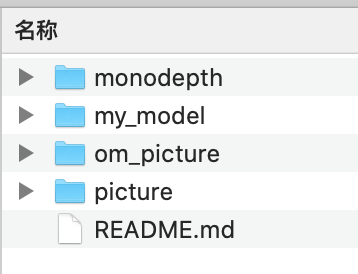
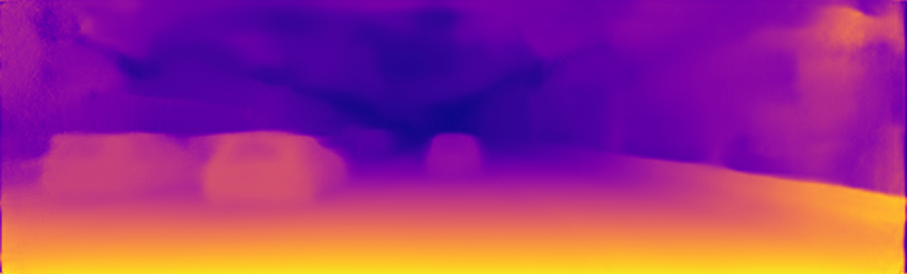
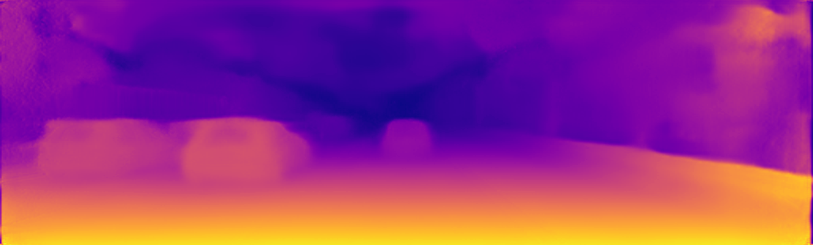

# Monodepth 离线推理

## 1. 参考资料

[monodepth 参考源码地址](https://github.com/mrharicot/monodepth)

[monodepth 论文地址](https://arxiv.org/abs/1609.03677)

[monodepth 模型在NPU910上迁移运行地址](https://gitee.com/ascend/ModelZoo-TensorFlow/pulls/666)

## 2. 提交清单介绍



- monodepth 
  - ckpt2pb.py  存放将ckpt转成pb的程序
- om_picture
  - data  存放原始图片(.jpg) 和 运行om推理的效果图(_disp.png)
  - model  存放atc将pb转成om的model
  - src
    - colorize.py 存放将原始图片推理成为效果图的程序
- my_model
  - 存放NPU上运行的monodepth的ckpt
  - 百度云下载链接: https://pan.baidu.com/s/1lxAzegXct_bAuTWjBpYiAg 提取码: oowa
- picture 为markdown的图片

## 3. 离线推理效果

#### 原始图片


#### CKPT 效果图

> monodepth 目录下monodepth_simple.py运行效果



#### OM 推理效果图



## 4. 离线推理测试说明

### (1) 将ckpt转成pb

```shell
# 注意需要切到monodepth目录下（即ckpt2pb.py所在目录）
python3 ckpt2pb.py --data_path=/ --filenames_file=/
```

### (2) 将pb转成om

```shell
# 注意需要切到monodepth目录下
atc --model=./pb_model/monodepth.pb --framework=3 --output=../om_picture/model/tf_monodepth --soc_version=Ascend910
```

### (3)对原始图片进行推理

```shell
# 注意需要切到om_picture/src目录下执行；同时确保om_picture/data目录有.jpg的原始图片，推理结果也在当前目录。
python3 colorize.py
```

