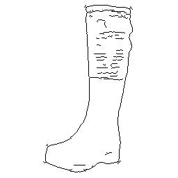
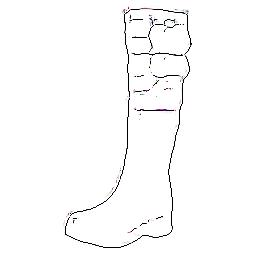
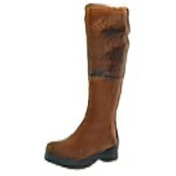

# MUNIT
MUNIT推理部分实现，模型概述详情请看MUNIT_ID0953_for_TensorFlow README.md

## 训练环境

* TensorFlow 1.15.0
* Python 3.7.0

## 代码及路径解释

```
MUNIT_ID0953_for_ACL
├── ckpt2pb.py                          ckpt模型固化为pb
├── pb2om.sh  				            act工具 pb==》om 转换命令
├── test_om.py 			                推理数据后处理
├── inference.sh			            msame工具：om离线推理命令
├── image2bin.py			            推理数据预处理：将image_test中的image文件转换为bin并进行其他图片预处理
├── image_test  			            测试数据集bin文件存放位置		
    └── valA                            domainA数据集
    └──	valB                            domainB数据集
    └── style	                        style文件
├── inference		                    msame推理结果bin文件存放位置		
    └── ..
├── inference_images 			        msame推理结果bin文件转图片
    └── inferA                          domainA的推理图片
    └── inferB                          domainB的推理图片
```


## 数据集
* edgestoshoes数据集（测试）

obs链接：obs://cann-id0953/dataset/edges2shoes/val/

## 模型文件
包括初始ckpt文件，固化pb文件，以及推理om文件

obs链接：obs://cann-id0953/final_files/

## pb模型

模型固化
```shell
python3 ckpt2pb.py
```
## 生成om模型
```shell
sh pb2om.sh
```
具体参数使用方法请查看官方文档。

## 将测试集图片转为bin文件
```shell
python3 image2bin.py
```
## 使用msame工具推理
```shell
sh inference.sh
```
参考 https://gitee.com/ascend/tools/tree/master/msame, 获取msame推理工具及使用方法。

## 使用推理得到的bin文件进行推理
```shell
python3 test_om.py
```

## 推理图片

* Input




* Output



