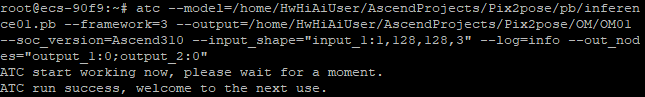
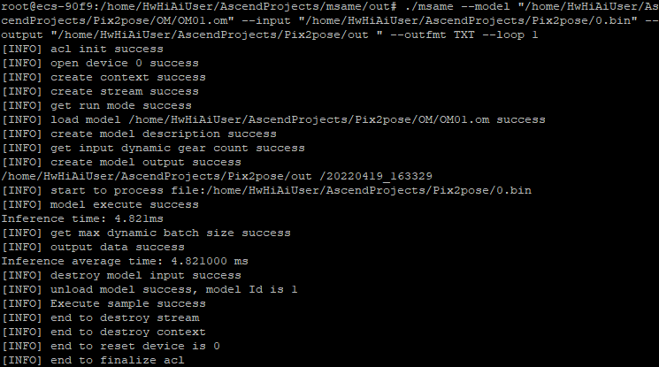
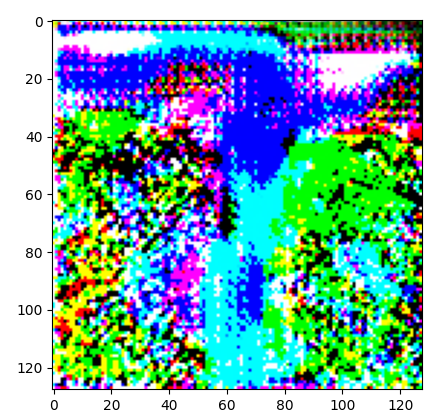

## Pix2pose_ID1164_for_TensorFlow_ACL

### 基本信息

**应用领域（Application Domain）：**6D Posture Estimation

**修改时间（Modified） ：2022.4.17**

**描述（Description）：基于TensorFlow框架的Pix2pose的6D姿态估计网络离线推理代码**

### 概述

Pix2Pose是一种经典的6D姿势估计方法。该模型可以在没有纹理的3D模型的情况下预测每个目标像素的三维坐标，解决了遮挡、对称和无纹理等问题，仅使用RGB图像来估计物体的6D姿势，并且能够构建具有精确纹理的三维模型。Pix2Pose设计了一个自动编码器结构来估计三维坐标和每个像素的预期误差，然后在多个阶段使用这些像素的预测来形成二维到三维的对应关系，用RANSAC迭代的PnP算法直接计算姿态，并利用生成式对抗训练来精确地覆盖被遮挡的部分，对遮挡的情况具有鲁棒性，Pix2Pose还提出了一个新的损失函数，即变换器损失函数，用于将预测的姿态引导到最近的对称姿态来处理对称目标。

- 参考论文：

  [Park K ,  Patten T et al.  "Pix2Pose: Pixel-Wise Coordinate Regression of Objects for 6D Pose Estimation."  *2019 IEEE/CVF International Conference on Computer Vision (ICCV). IEEE, 2020.]
(https://arxiv.org/pdf/1908.07433.pdf)

- 参考实现：

  [Pix2Pose](https://github.com/kirumang/Pix2Pose)


### hdf5转pb

本模型基于keras框架实现，训练模型时以HDF5格式保存模型训练的权重，使用hdf52pb.py将模型和权重转化为pb，我们提供转换好的[hdf5模型文件](obs://pix2pose/tless_inference/pix2pose_weights/)。

hdf52pb.py主要代码如下：
```
def h5_to_pb(h5_weight_path, output_dir, out_prefix="output_", log_tensorboard=True):
    if not os.path.exists(output_dir):
        os.mkdir(output_dir)

    h5_model = build_model()
    h5_model.load_weights(h5_weight_path)

    out_nodes = []
    for i in range(len(h5_model.outputs)):
        out_nodes.append(out_prefix + str(i + 1))
        tf.identity(h5_model.output[i], out_prefix + str(i + 1))

    model_name = os.path.splitext(os.path.split(h5_weight_path)[-1])[0] + index + '.pb'

    sess = K.get_session()
    init_graph = sess.graph.as_graph_def()
    main_graph = graph_util.convert_variables_to_constants(sess, init_graph, out_nodes)
    graph_io.write_graph(main_graph, output_dir, name=model_name, as_text=False)
    if log_tensorboard:
        from tensorflow.python.tools import import_pb_to_tensorboard
        import_pb_to_tensorboard.import_to_tensorboard(os.path.join(output_dir, model_name), output_dir)

def build_model():
    h5_model = load_model(inference_model_hdf5)
    return h5_model

if __name__ == '__main__':
    output_dir = os.path.join(output_path)
    h5_weight_path=os.path.join(inference_weight_hdf5)
    h5_to_pb(h5_weight_path, output_dir)
    print('finished')
```
我们提供转换好的[pb模型文件](obs://pix2pose/tless_inference/pb/)。

### pb转om
使用ATC模型转换工具进行模型转换时可以参考如下指令:
```
atc --model=/home/HwHiAiUser/AscendProjects/path_to_file/file.pb --framework=3 --output=/home/HwHiAiUser/AscendProjects/path_to_file/filename_OM --soc_version=Ascend310 --input_shape="input_1:1,128,128,3" --log=info --out_nodes="output_1:0;output_2:0"
```

我们提供转换好的[om模型文件](obs://pix2pose/tless_inference/OM/)。



### msame工具
我们采用msame工具进行离线推理，参考[msame简介](https://gitee.com/ascend/tools/tree/master/msame), 获取msame推理工具及使用方法。

获取到msame可执行文件之后，进行推理测试。

### 数据集转bin
该过程原训练代码3_train_pix2pose.py中generator_train.predict（）函数后加入以下代码，直接获取预处理好的图片，并以bin格式存储：
```
    if not (os.path.exists(weight_dir + "/pb_input/")):
        os.makedirs(weight_dir + "/pb_input/")

    for i in range(n):
        img_org = X_src[i]
        inference = weight_dir + "/pb_input/" + str(i) + ".bin"
        img_org.tofile(inference)
```

为了测试，我们提供了测试数据集,这是我们转换好的[bin文件](obs://pix2pose/tless_inference/bin_input/)。

### 推理测试
使用msame推理工具，参考如下命令，发起推理测试：
```
./msame --model "/home/HwHiAiUser/AscendProjects/path_to_file/filename_OM.om" --input "/home/HwHiAiUser/AscendProjects/path_to_file/bin_name.bin" --output "/home/HwHiAiUser/AscendProjects/Pix2pose/out " --outfmt TXT --loop 1
```



最后，可视化后可以得到类似如下结果：



   
   
