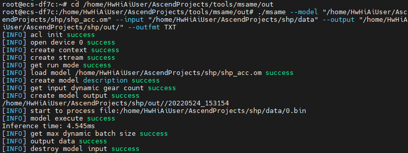

## SimpleHumanPose
### 基本信息

**发布者（Publisher）：Huawei**

**应用领域（Application Domain）：Human Pose Estimation**

**版本（Version）：1.0**

**修改时间（Modified） ：2022.05.23**

**框架（Framework）：TensorFlow 1.15.0**

**处理器（Processor）：昇腾910**

**应用级别（Categories）：Benchmark**

**描述（Description）：基于TensorFlow框架的SimpleHumanPose网络离线推理代码**

### 概述

SimpleHumanPose模型主要针对人体姿态估计和姿态追踪，提出一种简化的baseline。当前流行的人体姿态估计方法都过于复杂，各种模型在结构上看起来差异性很大，但是性能上又很接近，很难判断究竟是什么在起作用。相比于其他人体姿态估计模型，该模型并没有使用过多的技巧和理论依据。它以简单的技术为基础，通过全面的消融实验进行了验证，提出一个较为简化直观的模型，取得了良好的性能。

- 参考论文：

  https://arxiv.org/abs/1804.06208

- 参考实现：

  https://github.com/mks0601/TF-SimpleHumanPose

### 文件结构
```bash
├── README.md                                 //代码说明文档
├── LICENSE                                   //许可证
├── src
│    ├── data/                                 //包含数据加载代码
│    ├── lib/                                  //包含2D多人姿态估计系统的核心代码                   
│    ├── main/                                 //包含train/test网络、ckpt转pb、数据集转bin等代码
|    ├── boot_pb_frozen.py                     //ModelArts启动pb固化代码
|    ├── boot_inference.py                     //ModelArts启动计算精度代码
|    ├── boot_test.py                          //ModelArts启动测试代码
|    ├── pip-requirements.txt                  //配置文件，用于指定依赖包的包名及版本号    
```
### ckpt转pb
在main/pb_frozen.py中，将模型和权重转化为pb，可以使用ModelArts启动pb固化代码，我们提供转换好的pb模型文件: [obs链接，提取码：000000](https://e-share.obs-website.cn-north-1.myhuaweicloud.com?token=0xQYRip2sq0KE/psA/59+BRZKLxwglylSGDkKq9CCOl7T4Nsf80zWftId0Zc+TqRVTMTtR1TiXIDRq+a4W6N5HfkghM5sX1GTCI1T1xyYOLeq6YjcV1RRAHr8/mo/0DjOirO77RhAeQ+32iuuaWzbZU0UkcTvtIBWsYFzQgKOaDkaUUhmut8luIAdb97RhTwk9Xb9YwIvNF70BbD4MIemgJlzCgMIgg41X2PrRKyLa840RwBjNeM/3nRimUVLxPI2w1oFj08R7MPETcc9W5cEHlj8RxzJ2cgr/8F/OEBZQNqTq7fHSnWy2OqCxoD0Vj5QBLMztMGxadgGeuARd1G2Pb2+EXBf3N9mSTofqV6RowjgM5ETuhJuW2HCXEdZSJ6qPqtgwfLE4x6G12qkvA+cxG986L9lTGGrcugfTkTyPnLuSmz78pHBAAXBXiylok4cmRz3IM0BFkNk+C4CEKT30kmKceVYM33inGtR4kKvQk60UiGcRnjJVgDdPN0TtCiDE5Wq7MJ+dc10r8XMctCKVxJuHvt4vliJolTG4HqV9Q=)


pb_frozen.py主要代码如下：

```
tf.reset_default_graph()
model = Model()
model.make_network(is_train=False)

with tf.Session() as sess:
    tf.train.write_graph(sess.graph_def, result_dir, 'model.pb')

    freeze_graph.freeze_graph(
        input_graph=os.path.join(result_dir, 'model.pb'),
        input_saver='',
        input_binary=False,
        input_checkpoint=ckpt_path,
        output_node_names='out/BiasAdd',
        restore_op_name='save/restore_all',
        filename_tensor_name='save/Const:0',
        output_graph=os.path.join(result_dir, 'frozen_model.pb'),
        clear_devices=False,
        initializer_nodes=''
    )
```

### pb转om
使用ATC模型转换工具进行模型转换时可以参考如下指令，我们提供转换好的om模型文件: [obs链接，提取码：000000](https://e-share.obs-website.cn-north-1.myhuaweicloud.com?token=0xQYRip2sq0KE/psA/59+BRZKLxwglylSGDkKq9CCOl7T4Nsf80zWftId0Zc+TqRVTMTtR1TiXIDRq+a4W6N5HfkghM5sX1GTCI1T1xyYOLeq6YjcV1RRAHr8/mo/0DjOirO77RhAeQ+32iuuaWzbZU0UkcTvtIBWsYFzQgKOaDkaUUhmut8luIAdb97RhTwk9Xb9YwIvNF70BbD4MIemgJlzCgMIgg41X2PrRKyLa9sod8v7oOewaSzJFh6oPs0VltNRJ66ZKmZ3VwoUB6PPNZOjRT/vTBpMsioMbQkju8iNFs50rY2vHedwUvENXeC16JcpUGKHlsEjP4cp+2byr7TQmi0Rw6oBNj1AalqCEvvJumjhp+WLj32IT9Vl1Fz6d4aGLEPh2BiWxLO8ZvO3uXwjccj5g3jsr+r5Fwi5hE/gXSfjIiF82n1PDh2wVggyKogS+us60Qks6Gw9fGuAKSOURXV875yiYCFqnVfDcJEUB3sSx1WrcTDOMA+mE6aDAujlInC8aRgjP3XMTwkennHqtT9ZF6WRJ7BLx0cJ18=)

```
atc --model=/home/HwHiAiUser/AscendProjects/pb_model/frozen_model.pb --framework=3 --output=/home/HwHiAiUser/AscendProjects/shp/shp_acc --soc_version=Ascend310 --input_shape="Placeholder:1,256,192,3" --log=info --out_nodes="out/BiasAdd:0" --debug_dir=/home/module/out/debug_info
```
### msame工具
我们采用msame工具进行离线推理，参考[msame简介](https://gitee.com/ascend/tools/tree/master/msame), 获取msame推理工具及使用方法。

获取到msame可执行文件之后，进行推理测试。

### 数据集转bin
该过程在原测试代码main/test.py中加入如下代码，直接获取预处理好的图片，并以bin格式存储。我们提供整个测试集的bin文件：[obs链接，提取码：000000](https://e-share.obs-website.cn-north-1.myhuaweicloud.com?token=0xQYRip2sq0KE/psA/59+BRZKLxwglylSGDkKq9CCOl7T4Nsf80zWftId0Zc+TqRVTMTtR1TiXIDRq+a4W6N5HfkghM5sX1GTCI1T1xyYOLeq6YjcV1RRAHr8/mo/0DjOirO77RhAeQ+32iuuaWzbZU0UkcTvtIBWsYFzQgKOaDkaUUhmut8luIAdb97RhTwk9Xb9YwIvNF70BbD4MIemgJlzCgMIgg41X2PrRKyLa/P9zJ/LtBBd0k4otGQ1A8sc0OB//R4+u726ynIZI4FQtdyjW7D0wchg5zlGb3lgauEHw11Ja+jtGbC5td9ny18iMwEjCwJHo5BjeYYmXx1NlwddzjvU3b9nHTgM/CWl5OaxwP1GNy25DrCUr5nzjk+4XHG74gowNJ1VvqGk+g9Wj9oQcDC0uVBs/ROriyGpgG+qxIx2kN09VVjtvrXRfFgucCQjbOSeQHYz10ODie8wUFqOPZsWVp2idQtggqxTe9vkXdM0ivnWpudFyoOpDnTAuWCMtrq0hoGeav3pv45/MiTuoFCA9hPk5KSfh2yg48QC+hL4Po3c/hKih3qs+9yI9gj5mrLrqmHZr6MpuCzfvXRkxt3U6UOuaDAx13TTCBJMa78e86bl5tquAUeQ5NUQfOkQB7+eSf3nO8T0YBBX4ZgNAG8NPhcVwKm79vlbkf3O6iY2Ghr/Q/VXL7Mj52gkbcyHCUeugko1AnEtyAhflzbBYFHOR0dpCwA2PABxGmYhYq4g4bsCa/2xUsOon/9WG8Y+iQupL+bL1TH8lWyRQ==)
```
image = np.array(imgs)
bin_path = osp.join(cfg.bins_dir, "{}.bin".format(count))
image.tofile(bin_path)
count += 1
```
### 推理测试
使用msame推理工具，参考如下命令，发起推理测试。我们只使用了测试集中的部分数据进行推理（即如下命令中的data文件夹只包含360个bin文件）。

```
./msame --model "/home/HwHiAiUser/AscendProjects/shp/shp_acc.om" --input "/home/HwHiAiUser/AscendProjects/shp/data" --output "/home/HwHiAiUser/AscendProjects/shp/out/" --outfmt TXT
```
推理结果如下图所示：


然后使用获取到的推理结果计算精度，具体代码在main/pb_inference.py中。

### 推理精度
|Methods|AP|AP.5 |AP.75|AP(M)|AP(L)|AR|AR.5|AR.75|AR(M|AR(L)|
|--|--|--|--|--|--|--|--|--|--|--|
|原论文|70.2|89.0|77.6|66.8|76.9|76.0|93.1|82.7|71.7|82.3|
|离线推理|64.0|86.4|71.9|60.8|71.1|72.5|91.6|79.5|67.5|79.4|