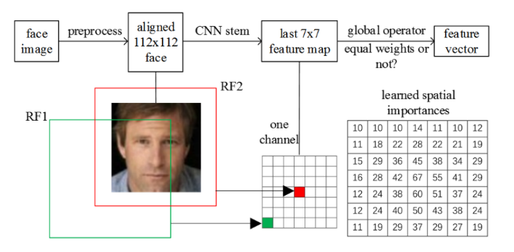

-   [基本信息](#基本信息.md)
-   [概述](#概述.md)
-   [模型性能](#模型性能.md)
-   [高级参考](#高级参考.md)

<h2 id="基本信息.md">基本信息</h2>

**发布者（Publisher）：Huawei**

**应用领域（Application Domain）：Face Verification** 

**版本（Version）：1.2**

**修改时间（Modified） ：2021.09.25**

**大小（Size）：4M**

**框架（Framework）：TensorFlow 1.15.0**

**模型格式（Model Format）：ckpt,pb,om**

**精度（Precision）：Mixed**

**处理器（Processor）：昇腾910A, 昇腾310**

**应用级别（Categories）：Demo**

**描述（Description）：基于TensorFlow框架的MobileFaceNet人脸识别网络训练,推理代码** 

<h2 id="概述.md">概述</h2>

MobileFaceNet 是一个非常高效的CNN模型，参数量仅有4M，但却在移动设备和嵌入设备上取得了颇具竞争力的精度。MobileFaceNet在最后一个卷积层之后使用了一个全局深度可分离卷积替代了原来的全局平均池化，从而使得性能有了进一步提升。


- 参考论文：

    [Sheng Chen, Yang Liu, et al. "MobileFaceNets: Efficient CNNs for Accurate Real-Time Face Verification on Mobile Device*](https://arxiv.org/abs/1804.07573)

- 参考实现：https://github.com/yangxue0827/MobileFaceNet_Tensorflow

## 默认配置<a name="section91661242121611"></a>

- 训练数据集预处理 （MS1M-refined数据集）

  - 图像的输入尺寸为112*112
  - 图像输入格式：TFRecord
  - 随机水平翻转图像
  - 根据数据集的平均值和标准偏差对输入图像进行归一化

- 测试数据集预处理 （LFW数据集）

  - 图像的输入尺寸为112*112
  - 图像输入格式：bin
  - 根据数据集的平均值和标准偏差对输入图像进行归一化

- 训练超参

  - Batch size: 64
  - Learning rate(LR): 0.01
  - Optimizer: ADAM
  - Weight decay: 0.00001
  - Train epoch: 10


## 数据准备

1. 计算om模型推理精度时需要使用LFW数据集的标签，可从[此处](https://disk.pku.edu.cn:443/link/B69373CFB78CF8467972C57AE81245E6)下载。然后将calculate_om_acc.py中的eval_db_path修改为数据的存放路径。


<h2 id="模型性能.md">模型性能</h2>

## 昇腾310芯片模型推理性能

1. 首先准备好模型参数固化之后的pb模型

2. 然后借助ATC工具将pb模型转换成能够在310芯片上进行推理的om模型，需执行如下的atc命令：

``` shell
atc --model=/root/zjx/MFN/pb_model/MobileFaceNet.pb --framework=3 --output=/root/zjx/MFN/tf_MobileFaceNet --soc_version=Ascend310 --input_shape='Placeholder:1,112,112,3' --precision_mode=allow_fp32_to_fp16 --op_select_implmode=high_precision
```

3. 将用于推理的数据转换成bin格式(脚本为./MobileFaceNet_Tensorflow/image2bin.py)。下方提供的网盘链接中有处理好的bin数据

```python
python3 image2bin.py
```

4. 借助msame工具，使用om模型进行离线推理,运行如下om_eval.sh脚本

```shell
# Ascend310 om model evaluation script
# model: om model path
# input dir: bin file path
# output dir: om_output path
msame --model './tf_MobileFaceNet.om' --input './bin_input' --output './om_output' 
```

5. 结合om模型推理所得输出，使用如下脚本计算om模型推理精度：

``` shell
python3 calculate_om_acc.py
```

6. 推理结果截图


### 310芯片推理性能与精度表现

| Parameters          |                                               |
| ------------------- | --------------------------------------------- |
| Resource            | Ascend 310; CPU 2.60GHz, 24cores; Memory, 72G |
| Tensorflow Version  | 1.15.0                                        |
| Dataset             | LFW                                           |
| batch_size          | 1                                             |
| Evaluation Accuracy | 98.7%                                         |
| Total time          | 0.305 s                                       |

### 提交模型网盘链接
* [网盘主链接](https://disk.pku.edu.cn:443/link/4AC5819F14C13461F88D36A3269A10BA)
* [pb模型、om模型、om推理使用的bin格式数据](https://disk.pku.edu.cn:443/link/C18ED520B38EFDAC29F8B26974460647)
* [数据集](https://disk.pku.edu.cn:443/link/A7A8A389B188F8BE4756837EC7B5A522)


<h2 id="高级参考.md">高级参考</h2>

## 脚本和示例代码<a name="section08421615141513"></a>

```
├── README.md
├── requirements.txt
├── LICENSE
├── author.txt
├── modelzoo_level.txt
├── imgs
├── MobileFaceNet_Tensorflow
│   ├── inference.py   #测试代码
│   ├── train_nets.py  #训练代码
│   ├── image2bin.py   #将测试数据转换为bin格式
│   ├── fusion_switch.cfg  # 关闭异常融合的规则
│   ├── losses
│   ├── nets
│   ├── output
│   ├── utils
├── calculate_om_acc.py #计算om模型推理结果的精度
```

## 脚本参数<a name="section6669162441511"></a>

```
-max_epoch 训练过程的轮数，默认为10
-train_batch_size 训练批大小，默认为64
```

说明：当前代码仅支持单卡训练与验证。

