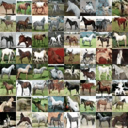
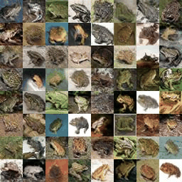
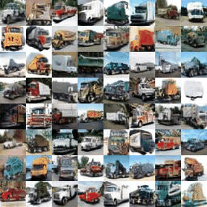
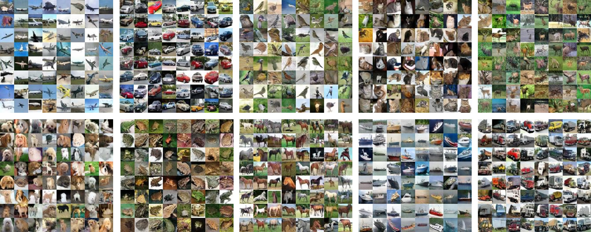

-   [基本信息](#基本信息.md)
-   [概述](#概述.md)
-   [训练环境准备](#训练环境准备.md)
-   [快速上手](#快速上手.md)
-   [训练结果](#训练结果.md)
-   [高级参考](#高级参考.md)
-   [离线推理](#离线推理.md)
<h2 id="基本信息.md">基本信息</h2>

**发布者（Publisher）：Huawei**

**应用领域（Application Domain）：Computer Vision** 

**版本（Version）：1.0**

**修改时间（Modified） ：2022.04.15**

**大小（Size）：2.57MB**

**框架（Framework）：TensorFlow 1.15.0**

**模型格式（Model Format）：ckpt**

**精度（Precision）：fp32**

**处理器（Processor）：昇腾910**

**应用级别（Categories）：Research**

**描述（Description）：基于TensorFlow框架进行条件图像生成的训练代码** 

<h2 id="概述.md">概述</h2>

BigGAN 是一种用于条件图像生成的 GAN 网络，可以用于生成指定类别的高质量图像。BigGAN 继承了 SAGAN 的主要思想，使用了自注意力模块来增强网络捕捉全局特征的能力，同时使用 hinge loss、谱归一化以及 TTUR 来增强训练的稳定性和效率。在此之上，BigGAN 通过大量的实验探索了大规模训练 GAN 网络的技巧，并通过加大批大小以及网络的深度和广度，大幅提升了模型性能。为了更有效地完成条件图像生成的任务，BigGAN 利用 shared-embedding、skip-z 和条件批归一化来向 Generator 提供类别信息，用投影的方法向 Discriminator 提供类别信息，进一步提升了模型性能。此外，BigGAN 还提出了截断技巧以及增强截断技巧稳定性的正交正则化用于平衡图像生成质量与多样性。

- 参考论文：

    https://arxiv.org/abs/1809.11096

- 参考实现：

    https://github.com/MingtaoGuo/BigGAN-tensorflow 

- 适配昇腾 AI 处理器的实现：
  
  
  https://gitee.com/ascend/ModelZoo-TensorFlow/tree/master/TensorFlow/contrib/cv/AnimeFaceGAN_ID1062_for_Tensorflow
        


- 通过Git获取对应commit\_id的代码方法如下：
  
    ```
    git clone {repository_url}    # 克隆仓库的代码
    cd {repository_name}    # 切换到模型的代码仓目录
    git checkout  {branch}    # 切换到对应分支
    git reset --hard ｛commit_id｝     # 代码设置到对应的commit_id
    cd ｛code_path｝    # 切换到模型代码所在路径，若仓库下只有该模型，则无需切换
    ```

## 默认配置<a name="section91661242121611"></a>

- 训练数据集预处理（以 Cifar-10 训练集为例，仅作为用户参考示例）：

  - 图像的输入尺寸为 $32\times32$
  - 图像输入格式：.mat
  - 生成图像类别数：10
- 训练超参

  - Batch size：64
  - Train step: 100000
  - Train step: 1000
  - Generator lr：1e-4；Discriminator lr：4e-4；beta1：0.0；beta2：0.9
  - Discriminator train step：2
  - Orthogonal regularization strength：1e-4
  - Truncation threshold：2.0
- 模型结构超参
  - Base channel：96
  - Latent space dimensionality：120
  - Shared embedding dimensionality：128


## 支持特性<a name="section1899153513554"></a>

| 特性列表   | 是否支持 |
| ---------- | -------- |
| 分布式训练 | 否       |
| 混合精度   | 否       |
| 并行数据   | 否       |

<h2 id="训练环境准备.md">训练环境准备</h2>

1.  硬件环境准备请参见各硬件产品文档"[驱动和固件安装升级指南]( https://support.huawei.com/enterprise/zh/category/ai-computing-platform-pid-1557196528909)"。需要在硬件设备上安装与CANN版本配套的固件与驱动。
2.  宿主机上需要安装Docker并登录[Ascend Hub中心](https://ascendhub.huawei.com/#/detail?name=ascend-tensorflow-arm)获取镜像。

    当前模型支持的镜像列表如[表1](#zh-cn_topic_0000001074498056_table1519011227314)所示。

    **表 1** 镜像列表

    <a name="zh-cn_topic_0000001074498056_table1519011227314"></a>
    <table><thead align="left"><tr id="zh-cn_topic_0000001074498056_row0190152218319"><th class="cellrowborder" valign="top" width="47.32%" id="mcps1.2.4.1.1"><p id="zh-cn_topic_0000001074498056_p1419132211315"><a name="zh-cn_topic_0000001074498056_p1419132211315"></a><a name="zh-cn_topic_0000001074498056_p1419132211315"></a><em id="i1522884921219"><a name="i1522884921219"></a><a name="i1522884921219"></a>镜像名称</em></p>
    </th>
    <th class="cellrowborder" valign="top" width="25.52%" id="mcps1.2.4.1.2"><p id="zh-cn_topic_0000001074498056_p75071327115313"><a name="zh-cn_topic_0000001074498056_p75071327115313"></a><a name="zh-cn_topic_0000001074498056_p75071327115313"></a><em id="i1522994919122"><a name="i1522994919122"></a><a name="i1522994919122"></a>镜像版本</em></p>
    </th>
    <th class="cellrowborder" valign="top" width="27.16%" id="mcps1.2.4.1.3"><p id="zh-cn_topic_0000001074498056_p1024411406234"><a name="zh-cn_topic_0000001074498056_p1024411406234"></a><a name="zh-cn_topic_0000001074498056_p1024411406234"></a><em id="i723012493123"><a name="i723012493123"></a><a name="i723012493123"></a>配套CANN版本</em></p>
    </th>
    </tr>
    </thead>
    <tbody><tr id="zh-cn_topic_0000001074498056_row71915221134"><td class="cellrowborder" valign="top" width="47.32%" headers="mcps1.2.4.1.1 "><a name="zh-cn_topic_0000001074498056_ul81691515131910"></a><a name="zh-cn_topic_0000001074498056_ul81691515131910"></a><ul id="zh-cn_topic_0000001074498056_ul81691515131910"><li><em id="i82326495129"><a name="i82326495129"></a><a name="i82326495129"></a>ARM架构：<a href="https://ascend.huawei.com/ascendhub/#/detail?name=ascend-tensorflow-arm" target="_blank" rel="noopener noreferrer">ascend-tensorflow-arm</a></em></li><li><em id="i18233184918125"><a name="i18233184918125"></a><a name="i18233184918125"></a>x86架构：<a href="https://ascend.huawei.com/ascendhub/#/detail?name=ascend-tensorflow-x86" target="_blank" rel="noopener noreferrer">ascend-tensorflow-x86</a></em></li></ul>
    </td>
    <td class="cellrowborder" valign="top" width="25.52%" headers="mcps1.2.4.1.2 "><p id="zh-cn_topic_0000001074498056_p1450714271532"><a name="zh-cn_topic_0000001074498056_p1450714271532"></a><a name="zh-cn_topic_0000001074498056_p1450714271532"></a><em id="i72359495125"><a name="i72359495125"></a><a name="i72359495125"></a>20.2.0</em></p>
    </td>
    <td class="cellrowborder" valign="top" width="27.16%" headers="mcps1.2.4.1.3 "><p id="zh-cn_topic_0000001074498056_p18244640152312"><a name="zh-cn_topic_0000001074498056_p18244640152312"></a><a name="zh-cn_topic_0000001074498056_p18244640152312"></a><em id="i162363492129"><a name="i162363492129"></a><a name="i162363492129"></a><a href="https://support.huawei.com/enterprise/zh/ascend-computing/cann-pid-251168373/software" target="_blank" rel="noopener noreferrer">20.2</a></em></p>
    </td>
    </tr>
    </tbody>
    </table>


<h2 id="快速上手.md">快速上手</h2>

- 数据集准备
1. 模型训练使用Cifar-10/ImageNet数据集，数据集请用户自行获取。

## 模型训练<a name="section715881518135"></a>

- 单击“立即下载”，并选择合适的下载方式下载源码包。

- 启动训练之前，首先要配置程序运行相关环境变量。

  环境变量配置信息参见：

     [Ascend 910训练平台环境变量设置](https://gitee.com/ascend/modelzoo/wikis/Ascend%20910%E8%AE%AD%E7%BB%83%E5%B9%B3%E5%8F%B0%E7%8E%AF%E5%A2%83%E5%8F%98%E9%87%8F%E8%AE%BE%E7%BD%AE?sort_id=3148819)

- 单卡训练 

  1. 配置训练参数。

     首先在脚本test/train_full_1p.sh中，配置batch_size、data_path、output_path等参数，请用户根据实际路径配置data_path，或者在启动训练的命令行中以参数形式下发。

     ```
      batch_size=64
      data_path="../dataset"
      output_path="../output"
     ```
     
  2. 启动训练。
  
     启动单卡训练 （脚本为AnimeFaceGAN_ID1062_for_Tensorflow/test/train_full_1p.sh） 
  
     ```
     bash train_full_1p.sh --data_path=../dataset --output_path=../output
     ```

<h2 id="训练结果.md">训练结果</h2>

- 精度结果比对

| 精度指标项      | 论文发布 | GPU实测 | NPU实测 |
| --------------- | -------- | ------- | ------- |
| Inception score | 9.22     | 6.66    | 6.98    |
| FID             | 14.73    | 45.06   | 38.47   |

- 性能结果比对

| 性能指标项 | GPU实测 | NPU实测 |
| ---------- | ------- | ------- |
| StepTime   | 347ms   | 196ms   |

***

- NPU 训练模型生成 $32\times32$ 图片

  

  

  

  

<h2 id="高级参考.md">高级参考</h2>

## 脚本和示例代码<a name="section08421615141513"></a>

```
├── train.py                                  //网络训练与测试代码
├── README.md                                 //代码说明文档
├── pb_frozen.py                      //训练模型固化为pb模型代码
├── test_pb.py                      //测试pb模型代码
├── requirements.txt                             //训练python依赖列表
├── utils.py								//工具函数代码
├── ops.py								//BigGAN基础模块代码
├── networks_32.py								//用于训练32x32图像的网络结构代码
├── networks_64.py								//用于训练64x64图像的网络结构代码
├── networks_128.py								//用于训练128x128图像的网络结构代码
├── help_modelarts.py								//Modelarts训练工具代码
├── boot_modelarts.py								//Modelarts训练代码
├── generate_fake_img.py								//在线推理代码
├── calc_IS_FID.py								//计算IS、FID代码
├── input2bin.py								//将输入转化为.bin，用于离线推理
├── test_om.py								//测试离线推理精度
├── test
│    ├──train_performance_1p.sh              //单卡训练验证性能启动脚本
│    ├──train_full_1p.sh                    //单卡全量训练启动脚本
│    ├──train_full_1p_modelarts.sh                    //modelarts全量训练启动脚本
├── scripts
│    ├──run_1p.sh              //Modelarts训练脚本
│    ├──run_cpu.sh              //CPU训练脚本
│    ├──run_gpu.sh              //GPU训练脚本
│    ├──run_msprof.sh              //解析Profiling数据脚本
├── metrics					//计算IS、FID相关代码
│    ├──...
```

## 训练过程<a name="section1589455252218"></a>

1.  通过“模型训练”中的训练指令启动单卡卡训练。

2.  参考脚本的模型存储路径为../output/model/xx/model.ckpt，其中"xx"为训练时的图片大小，取值为32/64/128。

## 离线推理

**离线推理精度**

| 精度指标项      | NPU在线推理 | NPU离线推理 |
| --------------- | ----------- | ----------- |
| Inception score | 6.98        | 6.37        |
| FID             | 38.47       | 47.06       |

***

**离线推理步骤**

1. 运行 pb_frozen.py，将训练模型转为 PB 文件 (final_model.pb)
2. 使用 ATC 工具将 .pb 文件转为 .om 文件

```bash
/usr/local/Ascend/ascend-toolkit/set_env.sh	# source 环境变量
export ASCEND_SLOG_PRINT_TO_STDOUT=1	# 设置输出日志打屏

mkdir /root/debug_info
atc --model=/root/final_model.pb \		# 这里的路径需要根据 .pb 的实际路径进行更改
	--framework=3 \
	--output=/root/model \
	--soc_version=Ascend310 \
	--input_shape="z:1,120;y:1,1" \
	--log=info \
	--out_nodes="output:0" \
	--debug_dir=/root/debug_info \
| tee atc.log
```

3. 运行 input2bin.py，将输入数据转换为 .bin 文件
4. 使用 msame 测试模型离线推理

```bash
y_path=./input_bin/32/y	# 这里的路径需要根据 .bin 的实际路径进行更改
z_path=./input_bin/32/z
ulimit -c 0
mkdir ./inference
./msame --model ./model.om \	# 这里的路径需要根据 .om 的实际路径进行更改
	   --input ${z_path},${y_path} \
	   --output ./inference \
	   | tee ./msame.log
```

5. 运行 test_om.py，测试离线推理精度
