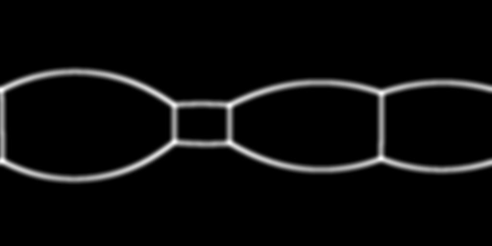
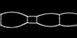
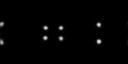

# 基本信息

**发布者（Publisher）：Huawei**

**应用领域（Application Domain）：Computer Vision**

**版本（Version）：1.1**

**修改时间（Modified）：2022.03.09**

**大小（Size）：117KB**

**框架（Framework）：Tensorflow 1.15.0**

**模型格式（Model Format）：ckpt**

**精度（Precision）：Mixed**

**处理器（Processor）：昇腾910**

**应用级别（Categories）：Research**

**描述（Description）：基于Tensorflow框架对360°全景图片实现3D布局恢复的测试代码**

# 模型概述

CFL模型是CFL: End-to-End Layout Recovery from 360 Images论文的Tensorflow实现，该论文的核心思想是使用StdConvs模型和EquiConvs模型分别在360°全景图片上实现3D布局恢复，并生成边图和角图。需要注意的是，此脚本是使用了StdConvs模型。

- 参考论文

  [Corners for Layout: End-to-End Layout Recovery from 360 Images (cfernandezlab.github.io)](https://cfernandezlab.github.io/CFL/)

- 参考实现

  [GitHub - cfernandezlab/CFL: Tensorflow implementation of our end-to-end model to recover 3D layouts. Also with equirectangular convolutions!](https://github.com/cfernandezlab/CFL)

# 默认配置

- 测试数据预处理（以SUN360测试集为例，仅作为用户参考示例）
  - 图像的输入尺寸：128×256
  - 图像的输入格式：jpg
- 测试超参
  - Batch size：16
  - Test epoch：1
  - Test step：72

# 支持特性

| 特性列表 | 是否支持 |
| :------: | :------: |
|  分布式  |    否    |
| 混合精度 |    是    |

# 混合精度

昇腾910 AI处理器提供自动混合精度功能，可以针对全网中float32数据类型的算子，按照内置的优化策略，自动将部分float32的算子降低精度到float16，从而在精度损失很小的情况下提升系统性能并减少内存使用。

脚本已默认开启混合精度，设置precision_mode参数的脚本参考如下。

```python
custom_op = config.graph_options.rewrite_options.custom_optimizers.add()
custom_op.name = "NpuOptimizer"
custom_op.parameter_map["precision_mode"].s = tf.compat.as_bytes("allow_mix_precision")
```

# 环境准备

- 硬件环境准备请参见各硬件产品文档"[驱动和固件安装升级指南](https://gitee.com/link?target=https%3A%2F%2Fsupport.huawei.com%2Fenterprise%2Fzh%2Fcategory%2Fai-computing-platform-pid-1557196528909)"，需要在硬件设备上安装与CANN版本配套的固件与驱动。
- 宿主机上需要安装Docker并登录[Ascend Hub中心](https://gitee.com/link?target=https%3A%2F%2Fascendhub.huawei.com%2F%23%2Fdetail%3Fname%3Dascend-tensorflow-arm)获取镜像。

# 快速上手

模型测试之前的准备工作：模型使用SUN360数据集和CFL模型训练得到的ckpt文件（见参考实现），数据集和ckpt文件请用户自行获取。

# 模型测试

- 单击“立即下载”，并选择合适的下载方式下载源码包。

- 启动测试之前，首先要配置程序运行相关环境变量。环境变量配置信息参见：[Ascend 910训练平台环境变量设置](https://gitee.com/ascend/modelzoo/wikis/Ascend 910训练平台环境变量设置?sort_id=3148819)

- 单卡测试

  - 配置参数

    首先在脚本test/train_full_1p.sh中，配置data_path、output_path等参数，请用户根据实际路径配置data_path和output_path，或者在启动测试的命令行中以参数形式下发。

    ```python
    batch_size=16
    data_path=./data_weights
    output_path=./output
    ```

  - 启动测试

    启动单卡测试（脚本为test/train_full_1p.sh）

    `bash test/train_full_1p.sh --data_path=./data_weights --output_path=./output`

# 测试结果

- 精度结果对比

  - EDGES

    | 精度指标项 | 论文发布 | GPU实测 | NPU实测 |
    | :--------: | :------: | :-----: | :-----: |
    |    IoU     |  0.575   |  0.588  |  0.583  |
    |  Accuracy  |  0.931   |  0.933  |  0.931  |
    | Precision  |  0.789   |  0.782  |  0.818  |
    |   Recall   |  0.667   |  0.691  |  0.661  |
    |  f1 score  |  0.722   |  0.733  |  0.730  |

  - CORNERS

    | 精度指标项 | 论文发布 | GPU实测 | NPU实测 |
    | :--------: | :------: | :-----: | :-----: |
    |    IoU     |  0.460   |  0.465  |  0.457  |
    |  Accuracy  |  0.974   |  0.974  |  0.974  |
    | Precision  |  0.887   |  0.872  |  0.885  |
    |   Recall   |  0.488   |  0.498  |  0.484  |
    |  f1 score  |  0.627   |  0.632  |  0.624  |

# 离线推理

##### 模型固化

执行get_pb.py文件，将model.ckpt固化为cflnet.pb（路径需根据实际情况修改）：

`python get_pb.py --dataset=./data/test --weights=./data/StdConvs/model.ckpt`

get_pb.py的工作逻辑为：

- 定义输入节点：input
- 定义输出节点：edge-estimator/output_likelihood/edge-estimator/output_likelihood
- 调用网络模型生成推理图
- 使用tf.train.writegraph将上述推理图保存成model.pb
- 使用freeze_graph将tf.train.writegraph生成的model.pb与model.ckpt文件合并，生成用于推理的pb图文件：cflnet.pb

##### 模型转换

使用ATC工具，将cflnet.pb转换为tf_cfl.om文件。

- 工具：请按照[`ATC`工具使用环境搭建](https://gitee.com/link?target=https%3A%2F%2Fsupport.huaweicloud.com%2Fatctool-cann502alpha3infer%2Fatlasatc_16_0004.html)搭建运行环境。

- 命令：`atc --model=./CFL/cflnet.pb --framework=3 --output=./CFL/tf_cfl --soc_version=Ascend310   --input_shape="input:1,128,256,3"`

- 参数：

  ```
  --model             pb模型文件
  --framework         源pb模型使用的框架 
  --output            生成.om文件的路径及名称
  --soc_version       使用的芯片类型
  --input_shape       输入的形状（batch_size,height,width,channel）
  ```

##### 离线推理

- 工具准备

  请参考https://gitee.com/ascend/tools/tree/master/msame，编译出msame推理工具。

- 数据处理

  通过调用jpg2bin.py文件（路径需根据实际情况修改），将模型测试集中的第一张p1.jpg图片文件转换为p1b.bin文件。

  `python jpg2bin.py --dataset=./data/test ==weights=./data/StdConvs/model.ckpt` 

  下面展示的分别是p1.jpg原图及其边图、角图的ground truth。

  
  
  


- 执行命令

  在编译好的msame工具目录下执行以下命令，会生成预测出的tf_cfl_output_0.bin文件。

  `./msame --model "/root/CFL/tf_cfl.om" --input "/root/CFL/data/p1b.bin" --output "/root/CFL/result" --outfmt BIN --loop 1`

- 结果评估

  - 为了检查评估离线推理的效果，需要将tf_cfl_output_0.bin转换成.jpg文件，通过执行bin2jpg.py文件实现（路径需根据实际情况修改）。

    `python bin2jpg.py --dataset=./data/test --weights=./data/StdConvs/model.ckpt`

    下面展示的是边图和角图的预测结果。

    
    
    
   

  - 生成图片之后，调用evaluate.py文件，对结果进行精度评估（路径需根据实际情况修改）。

    `python evaluate.py --dataset=./data/test --weights=./data/StdConvs/model.ckpt`

    | 指标 |  IoU  | Accuracy | Precision | Recall | f1 score |
    | :--: | :---: | :------: | :-------: | :----: | :------: |
    | 均值 | 0.589 |  0.963   |   0.919   | 0.628  |  0.741   |

- 中间文件

  离线推理过程生成的中间文件可在[百度网盘](https://pan.baidu.com/s/1TSK8yJLm32jhE1SBbcPDvQ)获取，提取码：14uq

# 高级参考

##### 文件说明

```python
|--Image                      //存放图片
     |--p1.jpg
     |--p1_CM.jpg
     |--p1_CM_test.jpg
     |--p1_EM.jpg
     |--p1_EM_test.jpg
|--Models
 	 |--__init__.py           //网络初始化
     |--CFL_StdConvs.py       //网络构建
     |--network.py            //网络结构
|--test
     |--train_full_1p.sh      //单卡全量启动脚本
|--License                    //声明
|--README.md                  //代码说明文档
|--bin2jpg.py                 //.bin文件转.jpg文件
|--config.py                  //参数设置文件
|--evaluate.py                //评估推理结果
|--get_pb.py                  //模型固化
|--jpg2bin.py                 //.jpg文件转.bin文件
|--modelarts_entry_acc.py     //拉起测试文件
|--modelzoo_level.txt         //网络进度
|--requirements.txt           //python依赖列表
|--test_CFL.py                //网络测试代码
|--output                     //测试结果存放路径
|--data_weights               //数据集和ckpt文件存放路径
     |--Datasets
          |--SUN360
               |--test
                    |--CM_gt
                         |--pano_0b9db1eaf8b73158dd047b8f810cf0cc_CM.jpg
                         ...
                         |--pano_azzfywvfwnlpcl_CM.jpg
                    |--EM_gt
                         |--pano_0b9db1eaf8b73158dd047b8f810cf0cc_EM.jpg
                         ...
                         |--pano_azzfywvfwnlpcl_EM.jpg
                    |--RGB
                         |--pano_0b9db1eaf8b73158dd047b8f810cf0cc.jpg
                         ...
                         |--pano_azzfywvfwnlpcl.jpg
```

##### 脚本参数

```python
--batch_size        每个NPU的batch size,默认:16
--data_path         数据集路径,默认:./data_weights
--output_path       结果输出路径,默认:./output
```
