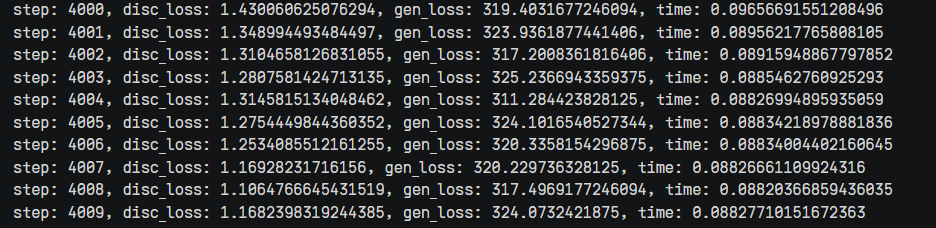
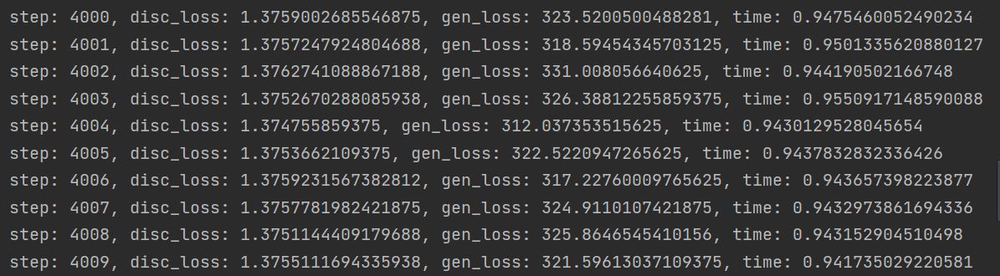

# 简介
CS_GAN模型是论文“Deep Compressed Sensing”的Tensorflow实现（基于晟腾NPU）。
# 文件说明
* model文件: 存放inception模型
* main.py: 训练脚本
* net.py：定义网络
* gan.py：定义GAN模型
* cs.py：压缩感知算法实现
* image_metrics.py：评估图像指标
# 依赖安装
* pip install absl-py==0.7.1
* pip install dm-sonnet==1.34
* pip install numpy==1.16.4
* pip install Pillow
* pip install tensorflow==1.15rc2
* pip install tensorflow-probability==0.7.0
* pip install tensorflow-gan==2.0.0
* 从obs://csgan-npu/CS_GAN_ID2064/中下载tensorflow_gan、tensorflow_hub、model等文件
# 数据集
* cifar
* obs地址：`obs://csgan-npu/CS_GAN_ID2064/cifar/`
# GPU复现训练
* obs地址：`obs://csgan/`
* 训练log：`obs://csgan/loss+perf_gpu.txt`
* ckpt模型：`obs://csgan/output/gan/ckpt/`
# NPU复现训练
* 训练log：`obs://csgan-npu/MA-new-csgan_new-08-22-10-47/log/`
* ckpt模型：`obs://csgan-npu/MA-new-csgan_new-08-22-10-47/output/ckpt/`
# 训练精度对比
GPUloss:

NPUloss:

取10个模型在GPU和NPU上训练4000steps的训练损失，求平均后GPU上disc_loss为1.397,gen_loss为320.26。NPU上disc_loss为1.375,gen_loss为322.35。
计算disc_loss的误差为1.6%，gen_loss的误差为0.6%。
# 训练性能对比

# 测试精度
* TODO