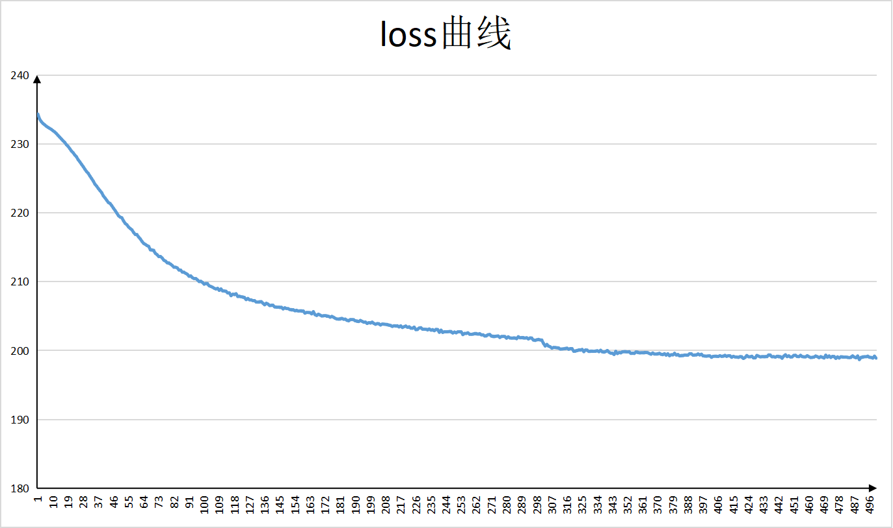

# CircleLoss

**Circle Loss: A Unified Perspective of Pair Similarity Optimization**

Yifan Sun et al.

CVPR 2020

ArXiv: [https://arxiv.org/abs/2002.10857](https://arxiv.org/abs/2002.10857)

本文提出了一种新的pair-wise的相似度优化损失函数，能够在学习过程中自适应地调整对不同类型相似度的惩罚程度，从而达到更加高效学习效果。


- 适配昇腾 AI 处理器的实现：
    
        
    https://gitee.com/ascend/ModelZoo-TensorFlow/tree/master/TensorFlow/contrib/cv/CircleLoss_ID1221_for_TensorFlow
        


- 精度

| -   | 论文    | GPU （v100） | NPU   |
|-----|-------|------------|-------|
| acc | 0.997 | 0.948      | 0.951 |

- 性能

| batchsize  |image_size| GPU （v100）   | NPU          |
|---|---|--------------|--------------|
| 30  | 112 x 112| 0.076 s/step | 0.046 s/step |


- ## 5.Loss曲线



- 训练超参

  - Batch size: 30
  - Learning rate(LR): 0.1
  - Optimizer: Adam
  - Loss: Circle loss

## 支持特性

| 特性列表  | 是否支持 |
|-------|------|
| 分布式训练 | 否    |
| 混合精度  | 是    |
| 并行数据  | 否    |

   
## 1. 依赖库安装

见requirements.txt， 需要安装 numpy， scikit-image， tensorflow等库。

## 2. 模型运行

- 模型精度评估

  1.启动模型精度评估。

     ```
     python modelarts_entry_acc.py --data_url obs://cann-id1221/dataset/ --train_url obs://cann-id1221/npu/
     ```

- 模型性能评估。

  1启动模型性能评估。

     ```
     python modelarts_entry_acc.py --data_url obs://cann-id1221/dataset/ --train_url obs://cann-id1221/npu/
     ```
