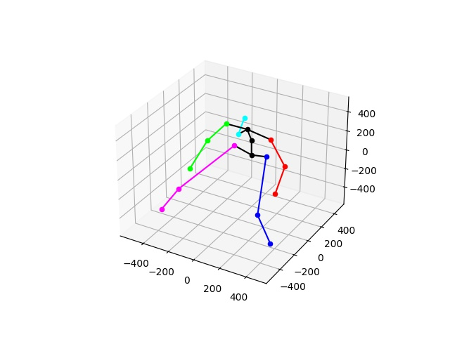

## 基本信息

**发布者（Publisher）：Huawei**

**应用领域（Application Domain）：Computer Vision**

**框架（Framework）：TensorFlow 1.15.0**

**模型格式（Model Format）：ckpt**

**精度（Precision）：Mixed**

**处理器（Processor）：昇腾910**

**应用级别（Categories）：Research**

**描述（Description）：基于TensorFlow框架对图片中姿势进行检测的训练代码** 

## 概述

	LiftingFromTheDeep

- 参考论文：

    https://openaccess.thecvf.com/content_cvpr_2017/papers/Tome_Lifting_From_the_CVPR_2017_paper.pdf

- 参考实现：

    https://github.com/DenisTome/Lifting-from-the-Deep-release


## 默认配置<a name="section91661242121611"></a>

- 训练数据集预处理:

  - 图像的输入尺寸为 1080*720
  - 图像输入格式：jpg

- 训练超参

  - Batch size： 4
  - Train epoch: 30

## 快速上手

数据集准备
模型训练使用MPII数据集，数据集请用户自行获取.  
obs桶地址:
>obs://cann-id0891/npu/

## 模型训练
单卡训练 

1. 配置训练参数
2. 启动训练
```
bash train_full_1p.sh \    
    --data_path="./dataset/MPII" \  
    --output_path="./checkpoint/model.ckpt"
```


## 训练结果

- 精度结果比对

|精度指标项|GPU实测|NPU实测|
|---|---|---|
|PCkh@0.5|0.819410|0.814496|

- 性能结果比对  

|性能指标项|GPU实测|NPU实测|
|---|---|---|
|FPS|10.04|10.56|


## 文件夹结构

```
├── README.md                                 //代码说明文档
├── train.py                                  //网络训练
├── online_inference.py                       //在线推理代码,用于推理单张图片
├── evaluate.py                               //用于衡量模型在数据集上的精度
├── requirements.txt                          //依赖列表
├── LICENSE                                   
├── packages
│    ├──lifting
│        ├──__init__.py
│        ├──_pose_estimator.py
│        ├──utils
│            ├──__init__.py
│            ├──config.py
│            ├──cpm.py
│            ├──draw.py
│            ├──prob_model.py
│            ├──process.py
│            ├──upright.py
├── checkpoint                                //checkpoint模型保存地址
├── data
│    ├──prob_model
│        ├──prob_model_params.mat
│    ├──init_session
│        ├──checkpoint
│        ├──init.data-00000-of-00001
│        ├──init.index
│        ├──init.meta
├── dataset                                 //数据集文件夹
│    ├──MPII
│        ├──images
│            ├──000001163.jpg
│            ├──000003072.jpg
│            ├──...
│        ├──mpii_human_pose_v1_u12_2
│            ├──bsd.txt
│            ├──mpii_human_pose_v1_u12_1.mat
│            ├──README.md
├──result                                   //单张图片推理结果
│    ├──result2d.jpg
│    ├──result3d_0.jpg
├── test
│    ├──train_performance_1p.sh             //单卡训练验证性能启动脚本
│    ├──train_full_1p.sh                    //单卡全量训练启动脚本

```


## 启动脚本说明
在test文件夹下, 有train_performace_1p.sh和train_full_1p.sh脚本,
可分别用于检测训练性能与训练精度.

### 检测性能
命令：
```
bash train_performace_1p.sh \    
    --data_path="./dataset/MPII" \  
    --output_path="./checkpoint/model.ckpt"
```
打屏信息:

> awk: cmd. line:1: fatal: division by zero attempted  
>------------------ INFO NOTICE START------------------  
>INFO, your task have used Ascend NPU, please check your result.  
>------------------ INFO NOTICE END------------------  
>------------------ Final result ------------------  
>Final Performance images/sec : 10.56  
>Final Performance sec/step : 0.38  
>E2E Training Duration sec : 754  
>Final Train Accuracy :  

**注**：此处Final Train Accuracy为空, 原因是性能检测中不涉及validation过程, 不能检测精度.    
打屏日志的第一行错误提示来源于此.

### 检测精度
命令:
```
bash train_full_1p.sh \    
    --data_path="./dataset/MPII" \  
    --output_path="./checkpoint/model.ckpt"
```

打屏信息:
>------------------ INFO NOTICE START------------------  
>INFO, your task have used Ascend NPU, please check your result.  
>------------------ INFO NOTICE END------------------  
>------------------ Final result ------------------  
>Final Performance images/sec : 10.19  
>Final Performance sec/step : 0.39  
>E2E Training Duration sec : 21154  
>Final Train Accuracy : 0.814496

## 在线推理结果
### 输出图片：




