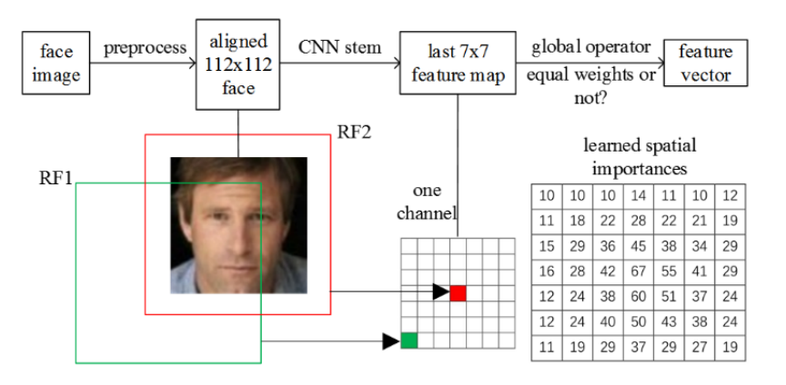

-   [基本信息](#基本信息.md)
-   [概述](#概述.md)
-   [训练环境准备](#训练环境准备.md)
-   [模型性能](#模型性能.md)
-   [高级参考](#高级参考.md)

<h2 id="基本信息.md">基本信息</h2>

**发布者（Publisher）：Huawei**

**应用领域（Application Domain）：Face Verification** 

**版本（Version）：1.1**

**修改时间（Modified） ：2021.09.25**

**大小（Size）：4M**

**框架（Framework）：TensorFlow 1.15.0**

**模型格式（Model Format）：ckpt,pb,om**

**精度（Precision）：Mixed**

**处理器（Processor）：昇腾910A, 昇腾310**

**应用级别（Categories）：Demo**

**描述（Description）：基于TensorFlow框架的MobileFaceNet人脸识别网络训练,推理代码** 

<h2 id="概述.md">概述</h2>

MobileFaceNet 是一个非常高效的CNN模型，参数量仅有4M，但却在移动设备和嵌入设备上取得了颇具竞争力的精度。MobileFaceNet在最后一个卷积层之后使用了一个全局深度可分离卷积替代了原来的全局平均池化，从而使得性能有了进一步提升。


- 参考论文：

    [Sheng Chen, Yang Liu, et al. "MobileFaceNets: Efficient CNNs for Accurate Real-Time Face Verification on Mobile Device*](https://arxiv.org/abs/1804.07573)

- 参考实现：https://github.com/yangxue0827/MobileFaceNet_Tensorflow

## 默认配置<a name="section91661242121611"></a>

- 训练数据集预处理 （MS1M-refined数据集）

  - 图像的输入尺寸为112*112
  - 图像输入格式：TFRecord
  - 随机水平翻转图像
  - 根据数据集的平均值和标准偏差对输入图像进行归一化

- 测试数据集预处理 （LFW数据集）

  - 图像的输入尺寸为112*112
  - 图像输入格式：bin
  - 根据数据集的平均值和标准偏差对输入图像进行归一化

- 训练超参

  - Batch size: 64
  - Learning rate(LR): 0.01
  - Optimizer: ADAM
  - Weight decay: 0.00001
  - Train epoch: 10

## 开启混合精度<a name="section20779114113713"></a>

脚本已默认开启混合精度，设置precision_mode参数的代码参考如下。

  ```
  custom_op.parameter_map["precision_mode"].s = tf.compat.as_bytes("allow_mix_precision")
  ```

<h2 id="训练环境准备.md">训练环境准备</h2>

1.  硬件环境准备请参见各硬件产品文档"[驱动和固件安装升级指南]( https://support.huawei.com/enterprise/zh/category/ai-computing-platform-pid-1557196528909)"。需要在硬件设备上安装与CANN版本配套的固件与驱动。
2.  宿主机上需要安装Docker并登录[Ascend Hub中心](https://ascendhub.huawei.com/#/detail?name=ascend-tensorflow-arm)获取镜像。

    当前模型支持的镜像列表如[表1](#zh-cn_topic_0000001074498056_table1519011227314)所示。

    **表 1** 镜像列表

    <a name="zh-cn_topic_0000001074498056_table1519011227314"></a>
    <table><thead align="left"><tr id="zh-cn_topic_0000001074498056_row0190152218319"><th class="cellrowborder" valign="top" width="47.32%" id="mcps1.2.4.1.1"><p id="zh-cn_topic_0000001074498056_p1419132211315"><a name="zh-cn_topic_0000001074498056_p1419132211315"></a><a name="zh-cn_topic_0000001074498056_p1419132211315"></a><em id="i1522884921219"><a name="i1522884921219"></a><a name="i1522884921219"></a>镜像名称</em></p>
    </th>
    <th class="cellrowborder" valign="top" width="25.52%" id="mcps1.2.4.1.2"><p id="zh-cn_topic_0000001074498056_p75071327115313"><a name="zh-cn_topic_0000001074498056_p75071327115313"></a><a name="zh-cn_topic_0000001074498056_p75071327115313"></a><em id="i1522994919122"><a name="i1522994919122"></a><a name="i1522994919122"></a>镜像版本</em></p>
    </th>
    <th class="cellrowborder" valign="top" width="27.16%" id="mcps1.2.4.1.3"><p id="zh-cn_topic_0000001074498056_p1024411406234"><a name="zh-cn_topic_0000001074498056_p1024411406234"></a><a name="zh-cn_topic_0000001074498056_p1024411406234"></a><em id="i723012493123"><a name="i723012493123"></a><a name="i723012493123"></a>配套CANN版本</em></p>
    </th>
    </tr>
    </thead>
    <tbody><tr id="zh-cn_topic_0000001074498056_row71915221134"><td class="cellrowborder" valign="top" width="47.32%" headers="mcps1.2.4.1.1 "><a name="zh-cn_topic_0000001074498056_ul81691515131910"></a><a name="zh-cn_topic_0000001074498056_ul81691515131910"></a><ul id="zh-cn_topic_0000001074498056_ul81691515131910"><li><em id="i82326495129"><a name="i82326495129"></a><a name="i82326495129"></a>ARM架构：<a href="https://ascend.huawei.com/ascendhub/#/detail?name=ascend-tensorflow-arm" target="_blank" rel="noopener noreferrer">ascend-tensorflow-arm</a></em></li><li><em id="i18233184918125"><a name="i18233184918125"></a><a name="i18233184918125"></a>x86架构：<a href="https://ascend.huawei.com/ascendhub/#/detail?name=ascend-tensorflow-x86" target="_blank" rel="noopener noreferrer">ascend-tensorflow-x86</a></em></li></ul>
    </td>
    <td class="cellrowborder" valign="top" width="25.52%" headers="mcps1.2.4.1.2 "><p id="zh-cn_topic_0000001074498056_p1450714271532"><a name="zh-cn_topic_0000001074498056_p1450714271532"></a><a name="zh-cn_topic_0000001074498056_p1450714271532"></a><em id="i72359495125"><a name="i72359495125"></a><a name="i72359495125"></a>20.2.0</em></p>
    </td>
    <td class="cellrowborder" valign="top" width="27.16%" headers="mcps1.2.4.1.3 "><p id="zh-cn_topic_0000001074498056_p18244640152312"><a name="zh-cn_topic_0000001074498056_p18244640152312"></a><a name="zh-cn_topic_0000001074498056_p18244640152312"></a><em id="i162363492129"><a name="i162363492129"></a><a name="i162363492129"></a><a href="https://support.huawei.com/enterprise/zh/ascend-computing/cann-pid-251168373/software" target="_blank" rel="noopener noreferrer">20.2</a></em></p>
    </td>
    </tr>
    </tbody>
    </table>

## 数据准备

1. 模型训练使用ms1m-refined数据集，从[此处](https://disk.pku.edu.cn:443/link/809B14DB5F41887B325F3B2565729848)获取预处理好的Tfrecord数据。

2. 数据集获取后，放入MobileFaceNet/datasets/tfrecords/目录下，在训练脚本中指定数据集路径，可正常使用。
3. 验证数据集使用LFW数据集，从该[链接](https://disk.pku.edu.cn:443/link/B69373CFB78CF8467972C57AE81245E6)下载。


## 模型训练<a name="section715881518135"></a>

- 单击“立即下载”，并选择合适的下载方式下载源码包。

- 启动训练之前，首先要配置程序运行相关环境变量。

  环境变量配置信息参见：

     [Ascend 910训练平台环境变量设置](https://gitee.com/ascend/ModelZoo-TensorFlow/wikis/01.%E8%AE%AD%E7%BB%83%E8%84%9A%E6%9C%AC%E8%BF%81%E7%A7%BB%E6%A1%88%E4%BE%8B/Ascend%20910%E8%AE%AD%E7%BB%83%E5%B9%B3%E5%8F%B0%E7%8E%AF%E5%A2%83%E5%8F%98%E9%87%8F%E8%AE%BE%E7%BD%AE)

- 单卡训练 
    * 启动单卡训练 （脚本为scripts/train_1p_full.sh）
     ```
     sh train_1p_full.sh > ../logs/loss+perf.txt
     ```
     对于只需要执行一些step的训练过程的用户，可执行只训练少量steps的脚本
     ```
     sh train_1p_less.sh
     ```

- 验证
  * 启动910单卡测试 （脚本为scripts/test.sh）先将[npu_checkpoint](https://disk.pku.edu.cn:443/link/8E67892596F265C2BFB92FBD181D5008)下载到MobileFaceNet_Tensorflow/output/ckpt_best/目录下，然后使用如下脚本进行测试。
    ```
    sh test.sh > ../logs/test.txt
    ```
  * 启动310单卡测试（脚本为scripts/om_eval.sh）,借助msame工具得到om模型在310芯片上的推理结果，结合om_acc.py脚本即可查看om模型推理精度
     ```
     sh om_eval.sh
     python3 calculate_om_acc.py
     ```

<h2 id="模型性能.md">模型性能</h2>

## 1. 昇腾910A芯片模型性能

### 训练精度与性能

| Parameters                 |    NPU                  | GPU                           |
| -------------------------- | ----------------------- |------------------------------ |
| Resource                   | Ascend 910              |GPU                            |
| Tensorflow Version         | 1.15.0                  |1.15.0                         |
| Dataset                    | LFW                     |LFW                            |
| Training Parameters        | epoch=10, batch_size=64 |epoch=10, batch_size=128       |
| Optimizer                  | ADAM                    |ADAM                           |
| Loss                       | 1.93                    |1.82                           |
| Validation Accuracy        | 98.7%                   |98.5% (99.2% in paper)         |
| Speed                      | 600 samples/s           |200 samples/s                  |
| Total time                 | 23 hours                |60 hours                       |


### 测试性能与精度表现

| Parameters          |                                               |
| ------------------- | --------------------------------------------- |
| Resource            | Ascend 910; CPU 2.60GHz, 24cores; Memory, 72G |
| Tensorflow Version  | 1.15.0                                        |
| Dataset             | LFW                                           |
| batch_size          | 100                                           |
| Evaluation Accuracy | 98.7%                                         |
| Total time          | 102s                                          |

[GPU版本网盘链接](https://disk.pku.edu.cn:443/link/B0678C6330A97CAC7430203009A137AF)

## 2. 昇腾310芯片模型推理性能

1. 首先将训练好的checkpoint文件通过freeze_graph.py脚本进行参数固化，得到pb模型

``` python
python3 freeze_grpah.py
```

2. 然后借助ATC工具将pb模型转换成能够在310芯片上进行推理的om模型，需执行如下的atc命令：

``` shell
atc --model=/root/zjx/MFN/pb_model/MobileFaceNet.pb --framework=3 --output=/root/zjx/MFN/tf_MobileFaceNet --soc_version=Ascend310 --input_shape='Placeholder:1,112,112,3' --precision_mode=allow_fp32_to_fp16 --op_select_implmode=high_precision
```

3. 将用于推理的数据转换成bin格式(脚本为./MobileFaceNet_Tensorflow/image2bin.py)

```python
python3 image2bin.py
```

4. 借助msame工具，使用om模型进行离线推理,运行如下om_eval.sh脚本

```shell
# Ascend310 om model evaluation script
# model: om model path
# input dir: bin file path
# output dir: om_output path
msame --model './tf_MobileFaceNet.om' --input './bin_input' --output './om_output' 
```

5. 结合om模型推理所得输出，使用如下脚本计算om模型推理精度：

``` shell
python3 calculate_om_acc.py
```

6. 推理结果截图


7. 网盘链接：[pb模型、om模型、om推理使用的bin格式数据](https://disk.pku.edu.cn:443/link/C18ED520B38EFDAC29F8B26974460647)

### 310芯片推理性能与精度表现

| Parameters          |                                               |
| ------------------- | --------------------------------------------- |
| Resource            | Ascend 310; CPU 2.60GHz, 24cores; Memory, 72G |
| Tensorflow Version  | 1.15.0                                        |
| Dataset             | LFW                                           |
| batch_size          | 1                                             |
| Evaluation Accuracy | 98.7%                                         |
| Total time          | 0.305 s                                       |


<h2 id="高级参考.md">高级参考</h2>

## 脚本和示例代码<a name="section08421615141513"></a>

```
├── README.md
├── requirements.txt
├── LICENSE
├── author.txt
├── modelzoo_level.txt
├── Dockerfile
├── imgs
├── scripts
│   ├── test.sh    #测试脚本
│   ├── om_eval.sh  #om推理脚本
│   ├── train_1p_less.sh  #少量step训练脚本
│   └── train_1p_full.sh  #完整训练脚本
├── MobileFaceNet_Tensorflow
│   ├── inference.py   #测试代码
│   ├── train_nets.py  #训练代码
│   ├── image2bin.py   #将测试数据转换为bin格式
│   ├── fusion_switch.cfg  # 关闭异常融合的规则
│   ├── arch
│   │   ├── img
│   │   ├── txt
│   ├── datasets
│   │   ├── faces_ms1m_112x112
│   │   ├── tfrecords
│   ├── losses
│   ├── nets
│   ├── output
│   ├── utils
├── log
|   ├── loss+perf.txt
|   └── test.txt
├── freeze_graph.py  #固化参数生成pb模型
├── calculate_om_acc.py #计算om模型推理结果的精度
```

## 脚本参数<a name="section6669162441511"></a>

```
-max_epoch 训练过程的轮数，默认为10
-train_batch_size 训练批大小，默认为64
```

说明：当前代码仅支持单卡训练与验证。

## 训练过程<a name="section1589455252218"></a>

1. 通过“模型训练”中的训练指令启动单卡训练

2. 完整训练过程的输出日志存储在../logs文件夹下
   
3. 训练过程中会间隔执行推理过程，同时输出validation accuracy日志

4. 下面是训练过程中的部分日志输出

```
WARNING:tensorflow:From /usr/local/Ascend/tfplugin/latest/tfplugin/python/site-packages/npu_bridge/estimator/npu/npu_optimizer.py:284: The name tf.train.Optimizer is deprecated. Please use tf.compat.v1.train.Optimizer instead.

WARNING:tensorflow:
The TensorFlow contrib module will not be included in TensorFlow 2.0.
For more information, please see:
  * https://github.com/tensorflow/community/blob/master/rfcs/20180907-contrib-sunset.md
  * https://github.com/tensorflow/addons
  * https://github.com/tensorflow/io (for I/O related ops)
If you depend on functionality not listed there, please file an issue.

WARNING:tensorflow:From train_nets.py:97: The name tf.placeholder is deprecated. Please use tf.compat.v1.placeholder instead.

Instructions for updating:
Use `for ... in dataset:` to iterate over a dataset. If using `tf.estimator`, return the `Dataset` object directly from your input function. As a last resort, you can use `tf.compat.v1.data.make_initializable_iterator(dataset)`.
begin db lfw convert.
loading bin 1000
loading bin 2000
loading bin 3000
loading bin 4000
loading bin 5000
loading bin 6000
loading bin 7000
loading bin 8000
loading bin 9000
loading bin 10000
loading bin 11000
loading bin 12000
(12000, 112, 112, 3)
2021-09-25 16:02:22.272842: I tensorflow/core/platform/cpu_feature_guard.cc:142] Your CPU supports instructions that this TensorFlow binary was not compiled to use: AVX2 AVX512F FMA
2021-09-25 16:02:22.306371: I tensorflow/core/platform/profile_utils/cpu_utils.cc:94] CPU Frequency: 2600000000 Hz
2021-09-25 16:02:22.312458: I tensorflow/compiler/xla/service/service.cc:168] XLA service 0x55df78ed3bf0 initialized for platform Host (this does not guarantee that XLA will be used). Devices:
2021-09-25 16:02:22.312507: I tensorflow/compiler/xla/service/service.cc:176]   StreamExecutor device (0): Host, Default Version
2021-09-25 16:02:22.744753: W tf_adapter/util/ge_plugin.cc:130] [GePlugin] can not find Environment variable : JOB_ID
2021-09-25 16:02:26.027238: W tf_adapter/util/infershape_util.cc:313] The InferenceContext of node _SOURCE is null.
2021-09-25 16:02:26.027304: W tf_adapter/util/infershape_util.cc:313] The InferenceContext of node _SINK is null.
2021-09-25 16:02:26.032384: W tf_adapter/util/infershape_util.cc:313] The InferenceContext of node init is null.
... ... 
Instructions for updating:
To construct input pipelines, use the `tf.data` module.
WARNING:tensorflow:`tf.train.start_queue_runners()` was called when no queue runners were defined. You can safely remove the call to this deprecated function.
==============  start training ===============
2021-09-25 16:03:11.789699: W tf_adapter/util/infershape_util.cc:313] The InferenceContext of node _SOURCE is null.
2021-09-25 16:03:11.789765: W tf_adapter/util/infershape_util.cc:313] The InferenceContext of node _SINK is null.
2021-09-25 16:03:11.790043: W tf_adapter/util/infershape_util.cc:337] The shape of node MobileFaceNet/MobileFaceNet/Conv2d_0/BatchNorm/cond/FusedBatchNormV3 output 5 is ?, unknown shape.
2021-09-25 16:03:11.790135: W tf_adapter/util/infershape_util.cc:337] The shape of node MobileFaceNet/MobileFaceNet/Conv2d_0/BatchNorm/cond/FusedBatchNormV3_1 output 5 is ?, unknown shape.
......
epoch 0, step 100, total loss is: 38.39, inference loss is: 38.25, reg_loss is: 0.14
epoch 0, step 200, total loss is: 29.42, inference loss is: 29.28, reg_loss is: 0.14
epoch 0, step 300, total loss is: 28.49, inference loss is: 28.34, reg_loss is: 0.14
epoch 0, step 400, total loss is: 25.56, inference loss is: 25.41, reg_loss is: 0.15
epoch 0, step 500, total loss is: 27.22, inference loss is: 27.07, reg_loss is: 0.15
epoch 0, step 600, total loss is: 24.44, inference loss is: 24.29, reg_loss is: 0.15
epoch 0, step 700, total loss is: 25.18, inference loss is: 25.03, reg_loss is: 0.15
epoch 0, step 800, total loss is: 20.31, inference loss is: 20.16, reg_loss is: 0.15
epoch 0, step 900, total loss is: 21.15, inference loss is: 21.00, reg_loss is: 0.15
epoch 0, step 1000, total loss is: 23.45, inference loss is: 23.29, reg_loss is: 0.15
epoch 0, step 1100, total loss is: 21.60, inference loss is: 21.45, reg_loss is: 0.16
epoch 0, step 1200, total loss is: 20.70, inference loss is: 20.54, reg_loss is: 0.16
epoch 0, step 1300, total loss is: 18.63, inference loss is: 18.47, reg_loss is: 0.16
epoch 0, step 1400, total loss is: 19.59, inference loss is: 19.43, reg_loss is: 0.16
epoch 0, step 1500, total loss is: 19.24, inference loss is: 19.08, reg_loss is: 0.16
epoch 0, step 1600, total loss is: 16.85, inference loss is: 16.69, reg_loss is: 0.16
epoch 0, step 1700, total loss is: 17.70, inference loss is: 17.53, reg_loss is: 0.16
epoch 0, step 1800, total loss is: 18.93, inference loss is: 18.76, reg_loss is: 0.17
epoch 0, step 1900, total loss is: 19.98, inference loss is: 19.81, reg_loss is: 0.17
epoch 0, step 2000, total loss is: 15.79, inference loss is: 15.62, reg_loss is: 0.17
==============  Validation: accuracy on 12000 LFW images is: 0.83717  ===============
epoch 0, step 2100, total loss is: 15.67, inference loss is: 15.50, reg_loss is: 0.17
epoch 0, step 2200, total loss is: 15.03, inference loss is: 14.85, reg_loss is: 0.17
epoch 0, step 2300, total loss is: 18.76, inference loss is: 18.59, reg_loss is: 0.17
epoch 0, step 2400, total loss is: 20.88, inference loss is: 20.70, reg_loss is: 0.18
epoch 0, step 2500, total loss is: 18.35, inference loss is: 18.17, reg_loss is: 0.18
epoch 0, step 2600, total loss is: 19.18, inference loss is: 19.01, reg_loss is: 0.18
epoch 0, step 2700, total loss is: 21.52, inference loss is: 21.34, reg_loss is: 0.18
epoch 0, step 2800, total loss is: 16.99, inference loss is: 16.81, reg_loss is: 0.18
epoch 0, step 2900, total loss is: 19.77, inference loss is: 19.59, reg_loss is: 0.18
epoch 0, step 3000, total loss is: 18.93, inference loss is: 18.75, reg_loss is: 0.19
epoch 0, step 3100, total loss is: 19.50, inference loss is: 19.31, reg_loss is: 0.19
epoch 0, step 3200, total loss is: 19.26, inference loss is: 19.07, reg_loss is: 0.19
epoch 0, step 3300, total loss is: 18.88, inference loss is: 18.69, reg_loss is: 0.19
epoch 0, step 3400, total loss is: 14.71, inference loss is: 14.52, reg_loss is: 0.19
epoch 0, step 3500, total loss is: 17.95, inference loss is: 17.76, reg_loss is: 0.19
epoch 0, step 3600, total loss is: 18.98, inference loss is: 18.78, reg_loss is: 0.19
epoch 0, step 3700, total loss is: 17.28, inference loss is: 17.08, reg_loss is: 0.20
epoch 0, step 3800, total loss is: 16.27, inference loss is: 16.08, reg_loss is: 0.20
epoch 0, step 3900, total loss is: 15.79, inference loss is: 15.59, reg_loss is: 0.20
epoch 0, step 4000, total loss is: 16.52, inference loss is: 16.32, reg_loss is: 0.20
==============  Validation: accuracy on 12000 LFW images is: 0.88000  ===============
epoch 0, step 4100, total loss is: 17.89, inference loss is: 17.69, reg_loss is: 0.20
epoch 0, step 4200, total loss is: 17.22, inference loss is: 17.02, reg_loss is: 0.20
... ...
```

## 验证过程<a name="section1465595372416"></a>

1. 通过“模型训练”中的测试指令启动测试。

2. 完整验证过程的输出日志存储在../log文件夹下

3. 下面是验证过程中的部分日志输出

```
WARNING:tensorflow:From /usr/local/Ascend/tfplugin/latest/tfplugin/python/site-packages/npu_bridge/estimator/npu/npu_optimizer.py:284: The name tf.train.Optimizer is deprecated. Please use tf.compat.v1.train.Optimizer instead.

WARNING:tensorflow:
The TensorFlow contrib module will not be included in TensorFlow 2.0.
For more information, please see:
  * https://github.com/tensorflow/community/blob/master/rfcs/20180907-contrib-sunset.md
  * https://github.com/tensorflow/addons
  * https://github.com/tensorflow/io (for I/O related ops)
If you depend on functionality not listed there, please file an issue.
WARNING:tensorflow:From inference.py:58: The name tf.placeholder_with_default is deprecated. Please use tf.compat.v1.placeholder_with_default instead.

begin db lfw convert.
loading bin 1000
loading bin 2000
loading bin 3000
loading bin 4000
loading bin 5000
loading bin 6000
loading bin 7000
loading bin 8000
loading bin 9000
loading bin 10000
loading bin 11000
loading bin 12000
(12000, 112, 112, 3)
... ...
2021-09-26 10:51:17.759372: W tf_adapter/util/ge_plugin.cc:130] [GePlugin] can not find Environment variable : JOB_ID
2021-09-26 10:51:20.801079: W tf_adapter/util/infershape_util.cc:313] The InferenceContext of node _SOURCE is null.
2021-09-26 10:51:20.801131: W tf_adapter/util/infershape_util.cc:313] The InferenceContext of node _SINK is null.
2021-09-26 10:51:20.805008: W tf_adapter/util/infershape_util.cc:313] The InferenceContext of node init is null.

Restoring pretrained model: ../MobileFaceNet_Tensorflow/output/ckpt_best
model_checkpoint_path: "../MobileFaceNet_Tensorflow/output/ckpt_best/MobileFaceNet_best.ckpt"
all_model_checkpoint_paths: "../MobileFaceNet_Tensorflow/output/ckpt_best/MobileFaceNet_best.ckpt"

2021-09-26 10:51:32.358933: W tf_adapter/util/infershape_util.cc:313] The InferenceContext of node _SOURCE is null.
2021-09-26 10:51:32.358985: W tf_adapter/util/infershape_util.cc:313] The InferenceContext of node _SINK is null.
2021-09-26 10:51:32.362829: W tf_adapter/util/infershape_util.cc:313] The InferenceContext of node save/restore_all is null.

testing...

best_threshold_index 123 0.9872222222222222
thresholds max: 1.23 <=> min: 1.23
best_threshold_index 123 0.9866666666666667
thresholds max: 1.23 <=> min: 1.23
best_threshold_index 123 0.9879629629629629
thresholds max: 1.23 <=> min: 1.23
best_threshold_index 123 0.9875925925925926
thresholds max: 1.23 <=> min: 1.23
best_threshold_index 123 0.9874074074074074
thresholds max: 1.23 <=> min: 1.23
best_threshold_index 123 0.9862962962962963
thresholds max: 1.23 <=> min: 1.23
best_threshold_index 123 0.9875925925925926
thresholds max: 1.23 <=> min: 1.23
best_threshold_index 123 0.9877777777777778
thresholds max: 1.23 <=> min: 1.23
best_threshold_index 123 0.9866666666666667
thresholds max: 1.23 <=> min: 1.23
best_threshold_index 123 0.9864814814814815
thresholds max: 1.23 <=> min: 1.23
total time 102.303 to evaluate 12000 images of lfw
Accuracy: 0.987
Testing Done
```