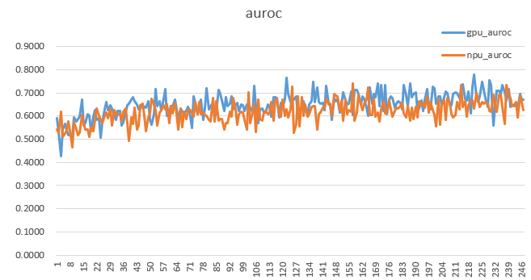

-   [基本信息](##基本信息.md)
-   [概述](#概述.md)
-   [训练环境准备](#训练环境准备.md)
-   [快速上手](#快速上手.md)
-   [训练结果](#训练结果.md)

## 基本信息

**发布者（Publisher）：Huawei**

**应用领域（Application Domain）： bacteria detection**

**版本（Version）：1.1**

**修改时间（Modified） ：2021.8.30**

**大小（Size）：183.65M**

**框架（Framework）：TensorFlow 1.15.0**

**模型格式（Model Format）：ckpt**

**精度（Precision）：FP32**

**处理器（Processor）：昇腾910**

**应用级别（Categories）：Official**

**描述（Description）基于TensorFlow框架的OOD细菌检测网络训练代码** 

<h2 id="#概述.md">概述</h2>

OOD是一个细菌检测网络，其主要特点是提出Likelihood Ratios并用以提高网络对于分布外细菌检测的准确性。
- 参考论文：

    [Jie Ren, Peter J. Liu. “Likelihood Ratios for Out-of-Distribution Detection” arXiv:1906.02845](https://arxiv.org/abs/1906.02845) 

- 参考实现：

    [genomics_ood-Tensorflow](https://github.com/google-research/google-research/tree/master/genomics_ood) 

- 适配昇腾 AI 处理器的实现：
  
  [https://gitee.com/ascend/ModelZoo-TensorFlow/tree/master/TensorFlow/contrib/cv/OOD_ID2046_for_TensorFlow](https://gitee.com/ascend/ModelZoo-TensorFlow/tree/master/TensorFlow/contrib/cv/OOD_ID2046_for_TensorFlow)      


- 通过Git获取对应commit\_id的代码方法如下：
  
    ```
    git clone {repository_url}    # 克隆仓库的代码
    cd {repository_name}    # 切换到模型的代码仓目录
    git checkout  {branch}    # 切换到对应分支
    git reset --hard ｛commit_id｝     # 代码设置到对应的commit_id
    cd ｛code_path｝    # 切换到模型代码所在路径，若仓库下只有该模型，则无需切换
    ```

## 默认配置<a name="section91661242121611"></a>

- 训练超参

  - Batch size: 100
  - Train step: 300000


## 支持特性<a name="section1899153513554"></a>

| 特性列表  | 是否支持 |
|-------|------|
| 分布式训练 | 否    |
| 混合精度  | 否    |
| 并行数据  | 否    |

<h2 id="训练环境准备.md">训练环境准备</h2>

1.  硬件环境准备请参见各硬件产品文档"[驱动和固件安装升级指南]( https://support.huawei.com/enterprise/zh/category/ai-computing-platform-pid-1557196528909)"。需要在硬件设备上安装与CANN版本配套的固件与驱动。
2.  宿主机上需要安装Docker并登录[Ascend Hub中心](https://ascendhub.huawei.com/#/detail?name=ascend-tensorflow-arm)获取镜像。

    当前模型支持的镜像列表如[表1](#zh-cn_topic_0000001074498056_table1519011227314)所示。

    **表 1** 镜像列表

    <a name="zh-cn_topic_0000001074498056_table1519011227314"></a>
    <table><thead align="left"><tr id="zh-cn_topic_0000001074498056_row0190152218319"><th class="cellrowborder" valign="top" width="47.32%" id="mcps1.2.4.1.1"><p id="zh-cn_topic_0000001074498056_p1419132211315"><a name="zh-cn_topic_0000001074498056_p1419132211315"></a><a name="zh-cn_topic_0000001074498056_p1419132211315"></a><em id="i1522884921219"><a name="i1522884921219"></a><a name="i1522884921219"></a>镜像名称</em></p>
    </th>
    <th class="cellrowborder" valign="top" width="25.52%" id="mcps1.2.4.1.2"><p id="zh-cn_topic_0000001074498056_p75071327115313"><a name="zh-cn_topic_0000001074498056_p75071327115313"></a><a name="zh-cn_topic_0000001074498056_p75071327115313"></a><em id="i1522994919122"><a name="i1522994919122"></a><a name="i1522994919122"></a>镜像版本</em></p>
    </th>
    <th class="cellrowborder" valign="top" width="27.16%" id="mcps1.2.4.1.3"><p id="zh-cn_topic_0000001074498056_p1024411406234"><a name="zh-cn_topic_0000001074498056_p1024411406234"></a><a name="zh-cn_topic_0000001074498056_p1024411406234"></a><em id="i723012493123"><a name="i723012493123"></a><a name="i723012493123"></a>配套CANN版本</em></p>
    </th>
    </tr>
    </thead>
    <tbody><tr id="zh-cn_topic_0000001074498056_row71915221134"><td class="cellrowborder" valign="top" width="47.32%" headers="mcps1.2.4.1.1 "><a name="zh-cn_topic_0000001074498056_ul81691515131910"></a><a name="zh-cn_topic_0000001074498056_ul81691515131910"></a><ul id="zh-cn_topic_0000001074498056_ul81691515131910"><li><em id="i82326495129"><a name="i82326495129"></a><a name="i82326495129"></a>ARM架构：<a href="https://ascend.huawei.com/ascendhub/#/detail?name=ascend-tensorflow-arm" target="_blank" rel="noopener noreferrer">ascend-tensorflow-arm</a></em></li><li><em id="i18233184918125"><a name="i18233184918125"></a><a name="i18233184918125"></a>x86架构：<a href="https://ascend.huawei.com/ascendhub/#/detail?name=ascend-tensorflow-x86" target="_blank" rel="noopener noreferrer">ascend-tensorflow-x86</a></em></li></ul>
    </td>
    <td class="cellrowborder" valign="top" width="25.52%" headers="mcps1.2.4.1.2 "><p id="zh-cn_topic_0000001074498056_p1450714271532"><a name="zh-cn_topic_0000001074498056_p1450714271532"></a><a name="zh-cn_topic_0000001074498056_p1450714271532"></a><em id="i72359495125"><a name="i72359495125"></a><a name="i72359495125"></a>20.2.0</em></p>
    </td>
    <td class="cellrowborder" valign="top" width="27.16%" headers="mcps1.2.4.1.3 "><p id="zh-cn_topic_0000001074498056_p18244640152312"><a name="zh-cn_topic_0000001074498056_p18244640152312"></a><a name="zh-cn_topic_0000001074498056_p18244640152312"></a><em id="i162363492129"><a name="i162363492129"></a><a name="i162363492129"></a><a href="https://support.huawei.com/enterprise/zh/ascend-computing/cann-pid-251168373/software" target="_blank" rel="noopener noreferrer">20.2</a></em></p>
    </td>
    </tr>
    </tbody>
    </table>

<h2 id="快速上手.md">快速上手</h2>

- 数据集准备
1. 数据集请用户自行获取，也可通过如下网址获取。

   [https://drive.google.com/corp/drive/folders/1Ht9xmzyYPbDouUTl_KQdLTJQYX2CuclR](https://drive.google.com/corp/drive/folders/1Ht9xmzyYPbDouUTl_KQdLTJQYX2CuclR)

2. 获得数据集后，放入模型目录下，在训练脚本中指定数据集路径，可正常使用。
   

## 模型训练<a name="section715881518135"></a>

- 单击“立即下载”，并选择合适的下载方式下载源码包。

- 启动训练之前，首先要配置程序运行相关环境变量。

  环境变量配置信息参见：

     [Ascend 910训练平台环境变量设置](https://gitee.com/ascend/ModelZoo-TensorFlow/wikis/01.%E8%AE%AD%E7%BB%83%E8%84%9A%E6%9C%AC%E8%BF%81%E7%A7%BB%E6%A1%88%E4%BE%8B/Ascend%20910%E8%AE%AD%E7%BB%83%E5%B9%B3%E5%8F%B0%E7%8E%AF%E5%A2%83%E5%8F%98%E9%87%8F%E8%AE%BE%E7%BD%AE)


- 单卡训练 

  1. 配置路径。

     在run.sh中配置代码和数据集存放路径，并设置模型输出路径

  2. 启动训练。

     运行run.sh即可：
     ```
     bash run.sh
     ```
     或直接在命令行输入以下命令（注意相关路径设置）：
     ```
     python3.7.5 -u $code_dir/generative.py \
     --model_type=background \
     --hidden_lstm_size=2000 \
     --val_freq=500 \
     --num_steps=300000 \
     --mutation_rate=0.0 \
     --reg_weight=0.0 \
     --in_tr_data_dir=$DATA_DIR/before_2011_in_tr \
     --in_val_data_dir=$DATA_DIR/between_2011-2016_in_val \
     --ood_val_data_dir=$DATA_DIR/between_2011-2016_ood_val \
     --out_dir=$OUT_DIR
     ```


<h2 id="训练结果.md">训练结果</h2>


## 精度对比：
GPU型号：Tesla V100-SXM2-16GB
NPU型号：昇腾910

以下GPU和NPU的结果取自70500-120000step,每500step评估一次，取100个AUROC的平均值（包括70500step及120000step）

|   | 论文 | GPU | NPU |
|-------|------|------|------|
| AUROC | 0.626 | 0.677 | 0.641 |


GPU和NPU的AUROC对比图：


