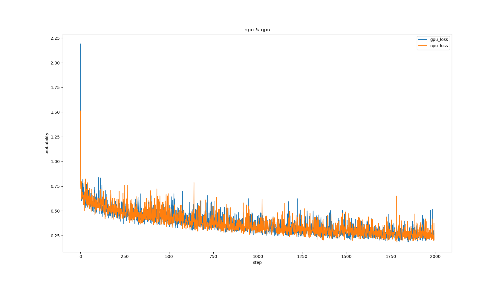
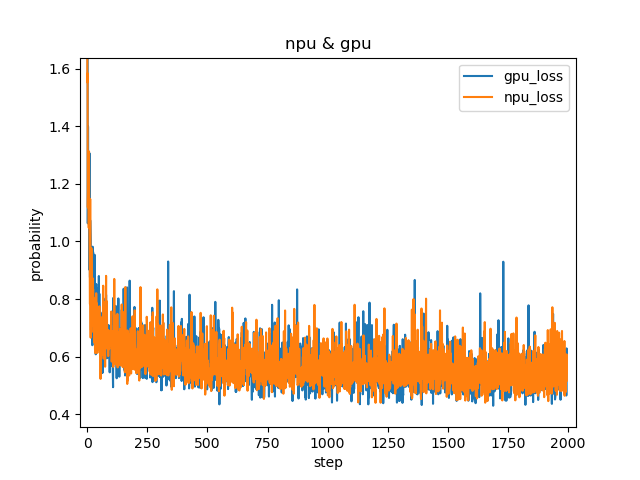

# SIAMESE

### Introduction

模型用于实时目标跟踪；模型主要有两个创新点：1.构建了一个用于实时目标跟踪的双重暹罗网络SA-Siam。SA-Siam由语义分支和外观分支组成。每个分支都是一个类似的学习暹罗语的网络。SA-Siam中的一个重要设计选择是分别训练两个分支，以保持两种类型特征的异质性。2.模型在语义分支提出了一种通道注意机制。根据目标位置周围的通道激活计算通道权重。
- 参考论文：
[A Twofold Siamese Network for Real-Time Object Tracking](https://arxiv.org/abs/1802.08817)
- 参考实现：
https://github.com/Microsoft/SA-Siam
- 适配昇腾 AI 处理器的实现：
https://gitee.com/yang-sipeng/siamese

### Requirements

运行SIAMESE模型需要安装以下依赖:
- tensorflow 1.15.0
- python 3.7.10
- sacred 0.8.2

### Dataset
模型训练使用网上开源ILSVRC2015_VID数据集，数据集请用户自行获取

### 支持特性
| 特性列表  | 是否支持 |
|-------|------|
| 分布式训练 | 否    |
| 混合精度  | 是    |
| 并行数据  | 是    |

### 混合精度训练
昇腾910 AI处理器提供自动混合精度功能，可以针对全网中float32数据类型的算子，按照内置的优化策略，自动将部分float32的算子降低精度到float16，从而在精度损失很小的情况下提升系统性能并减少内存使用

### 开启混合精度
脚本已默认开启混合精度，设置precision_mode参数的脚本参考如下
`custom_op = session_config.graph_options.rewrite_options.custom_optimizers.add()
custom_op.name = 'NpuOptimizer'
custom_op.parameter_map["precision_mode"].s = tf.compat.as_bytes(str(args.precision_mode))`

### 训练结果
- 精度结果比对
  - 外观分支

  

  - 语义分支  

  
### 高级参考
├── scripts                                //数据预处理  
├── experiments                            //网络训练  
│    ├──train-appearance-network.py        //语义分支训练  
│    ├──train-appearance-network.py        //外观分支训练  
├── test  
│    ├──train_performance_1p.sh            //单卡训练验证性能启动脚本  
│    ├──train_full_1p.sh                   //单卡全量训练启动脚本  
├── configuration.py                       //脚本参数

