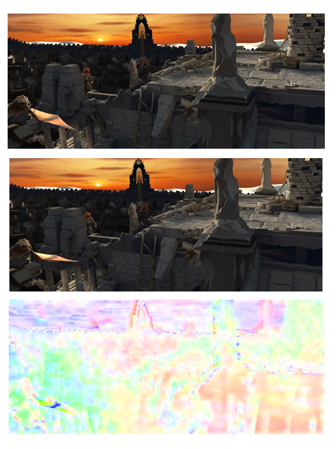

-   [基本信息](#基本信息.md)
-   [概述](#概述.md)
-   [训练环境准备](#训练环境准备.md)
-   [快速上手](#快速上手.md)
-   [迁移学习指导](#迁移学习指导.md)
-   [高级参考](#高级参考.md)
<h2 id="基本信息.md">基本信息</h2>

**发布者（Publisher）：Huawei**

**应用领域（Application Domain）：Image Processing**

**框架（Framework）：TensorFlow 1.15.0**

**模型格式（Model Format）：ckpt**

**精度（Precision）：Mixed**

**处理器（Processor）：昇腾910**

**应用级别（Categories）：Research**

**描述（Description）： The paper propose
TVNet, a novel end-to-end trainable neural network, to learn
optical-flow-like features from data.** 
<h2 id="概述.md">概述</h2>

    Despite the recent success of end-to-end learned representations, hand-crafted optical flow features are still widelyused in video analysis tasks. To fill this gap, we proposeTVNet, a novel end-to-end trainable neural network, to learnoptical-flow-like features from data

- 参考论文：

   https://openaccess.thecvf.com/content_cvpr_2018/papers/Fan_End-to-End_Learning_of_CVPR_2018_paper.pdf


- 适配昇腾 AI 处理器的实现：

  https://gitee.com/myd-git/ModelZoo-TensorFlow/tree/master/TensorFlow/contrib/cv/TVNet_ID0951_for_TensorFlow
     
- 通过Git获取对应commit\_id的代码方法如下：
    
    ```
    git clone {repository_url}    # 克隆仓库的代码
    cd {repository_name}    # 切换到模型的代码仓目录
    git checkout  {branch}    # 切换到对应分支
    git reset --hard ｛commit_id｝     # 代码设置到对应的commit_id
    cd ｛code_path｝    # 切换到模型代码所在路径，若仓库下只有该模型，则无需切换
    ```
  
## 默认配置<a name="section91661242121611"></a>

- 训练数据集预处理：

  - 图像的输入尺寸为1024*436
  - 图像输入格式：png

- 测试数据集预处理

  - 图像的输入尺寸为1024*436
  - 图像输入格式：png

- 训练超参

  - scale: Number of scales in TVNet (default: 1)
  - warp: Number of warppings in TVNet (default: 1)
  - iteration: Number of iterations in TVNet(default: 50)
  - Train step: 10000
  - gpu: the gpu to run on (0-indexed, -1 for CPU)

## 支持特性<a name="section1899153513554"></a>

| 特性列表  | 是否支持 |
|-------|------|
| 分布式训练 | 否    |
| 混合精度  | 是    |
| 并行数据  | 否    |


## 混合精度训练<a name="section168064817164"></a>

昇腾910 AI处理器提供自动混合精度功能，可以针对全网中float32数据类型的算子，按照内置的优化策略，自动将部分float32的算子降低精度到float16，从而在精度损失很小的情况下提升系统性能并减少内存使用。

## 开启混合精度<a name="section20779114113713"></a>

脚本已默认开启混合精度，设置precision_mode参数的脚本参考如下。

  ```
  custom_op = session_config.graph_options.rewrite_options.custom_optimizers.add()
  custom_op.name = 'NpuOptimizer'
  custom_op.parameter_map["precision_mode"].s = tf.compat.as_bytes(str(args.precision_mode))
  ```


<h2 id="快速上手.md">快速上手</h2>

- 数据集准备
1. 数据集下载链接：obs://cann-id0951/dataset/


## 模型训练<a name="section715881518135"></a>

- 单卡训练 

单卡训练 

1. 配置训练参数
2. 启动训练
```
bash train_full_1p.sh 
```

<h2 id="训练结果.md">训练结果</h2>


- 精度结果比对  

|精度指标项|GPU实测|NPU实测|
|---|---|---|
|LOSS|8.7241955|8.390178|

- 性能结果比对  

|性能指标项|GPU实测|NPU实测|
|---|---|---|
|FPS|1.0146|0.9366|

<h2 id="结果测试.md">结果测试</h2>
- 在test_sintel.py文件中修改测试的图片和指定模型的路径，然后运行该文件。
```
python test_sintel.py
```
- 用visualize（可视化脚本集合）执行得到的.mat文件，得到如下的结果：

<h2 id="高级参考.md">高级参考</h2>

## 脚本和示例代码<a name="section08421615141513"></a>

```
├── tvnet.py                           //模型搭建文件
├── train_epe_sintel.py                //读取数据进行训练
├── test_sintel.py                     //测试模型结果
├── spatial_transformer.py             //Spatial Transformer Layer
├── template.py                        //一些模板参数的设置
├── README.md                          //代码说明文档
```

## 脚本参数<a name="section6669162441511"></a>


```
--data_path              
--output_path            
--Batch size: 1
--Learning rate(LR): 1e-4
--Optimizer: Adam
--Train steps:10000 
```

## 训练过程<a name="section1589455252218"></a>

1.  通过“模型训练”中的训练指令启动单卡卡训练。

2.  参考脚本的模型存储路径为train_url
