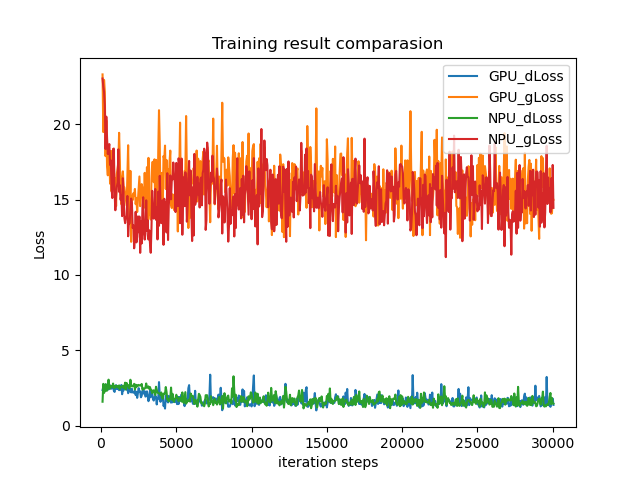

# SRNet - the implementation of paper "Editing Text in the Wild"
*** 

## 基本信息
#### 发布者(Publisher):Huawei
#### 应用领域（Application Domain）： Image Generator
#### 版本（Version）：1.0
#### 修改时间(Modified) ：2022.3.4 
#### 大小(size): 78.5M左右
#### 框架(Framework)：TensorFlow 1.15.0
#### 模型格式(Model Format): pb
#### 处理器(Processor): 昇腾910
#### 描述(Description): 基于TensorFlow框架的文本图片风格迁移网络训练代码
***

## 概述
此模型的来源是ACM Multimedia 2019上的一篇文章“Editing Text in the Wild”.  
这篇文章主要设计了一个模块化的DNN，完成了对替换给定图片之中文本内容的任务。在替换过程之中，源文本的文字大小、字体、颜色、朝向等细节将会被保留。DNN的各个模块分别完成整个任务的一部分，最后由一个合成模块将其余模块的输出融合在一起，生成目标图片。

本实现是基于[有道ai团队](https://github.com/youdao-ai)对原论文的一个[开源实现](https://github.com/youdao-ai/SRNet)之上进行NPU适配得到的结果。

参考论文:
* [Editing Text in the Wild](https://dl.acm.org/doi/pdf/10.1145/3343031.3350929)

论文的主要亮点是：
* 以往的图片文本迁移工作都是以单字母或者单字为单位的，此文之中实现的方法是以单词为单位的  
* 网络是采用模块化设计的，但是训练并不是一个模块一个模块单独进行训练，而是将整个网络进行端到端的训练
***

## 训练
### 数据集获取
按照原文，训练此模型，需要提供的数据集包含两部分，即输入图片i\_s, i\_t以及标记图片t\_sk, t\_t, t\_b, t\_f。  
在此版本的实现之中，新增了标记项mask\_t,代表原图片之中文本部分的二进制掩码。加入此项的原因是，此项会使得模型的训练收敛的更快。  
由于对于现实之中的图片，无法模型训练所需要提供的标记部分。因此，训练模型的数据集是人工合成的数据集。  
合成数据集需要提供纯净无文字的背景图片以及一些字体文件(.tff文件)，在完成准备工作之中，可以使用[SRNet_datagenerator](https://github.com/youdao-ai/SRNet-Datagen)来合成数据集。

### 模型训练
由于本实现针对华为的Modelarts平台进行了适配，因此训练部分将分成NPU训练(基于modelarts平台)以及GPU训练两部分。
测试所使用的环境为：
* numpy 1.21.2
* opencv-python 4.5.3
* opencv-contrib-python 4.5.4.58
* python 3.7
* tensorflow 1.15

由于Gitee平台对单文件大小的限制，训练过程之中采用的预训练模型无法直接上传，请通过OBS服务器[下载](https://cann-nju-srnet.obs.cn-north-4.myhuaweicloud.com:443/vgg19_weights_tf_dim_ordering_tf_kernels_notop.pb?AccessKeyId=DNOFMBDXF3DTPNGYLYN7&Expires=1679819348&Signature=xZTguiVqpKyGuGzko/AI8fu0ilM%3D)  
进行训练时，请将预训练模型保存在model_logs/vgg19目录下  

训练依托于华为的Modelarts平台。  
首先，下载并安装pycharm以及[华为modelart插件](https://modelarts-pycharm-plugin.obs.cn-north-1.myhuaweicloud.com/Pycharm-ToolKit-3.0.zip)，配置密钥  
然后，将准备好的数据集上传到华为OBS服务器上，并在modelarts插件之中进行如下配置  
* Fruquently-used  
  * AI Engine: Ascend-Powered-Engine, tensorflow_1.15-xxx  
  * Boot File Path: 仓库中npu_version/cfg.py对应的本地文件路径  
  * Code Directory: 仓库中npu-version对应的本地文件夹路径  
  * OBS Path: 训练时会自动将代码上传至OBS服务器，OBS Path对应OBS服务器中代码自动上传的位置  
  * Data Path in OBS: 数据集在OBS服务器之中存放的位置    
然后即可进行训练，最终的训练结果需要拷贝回OBS服务器，通过更改train.py第101行之中的参数dst_url来指定拷贝的目标路径。

## 测试
### 测试流程
在完成对模型的训练之后，可以采用训练得到的结果进行预测。  
预测的方式如下：
```console
$ python3 predict.py --i_s xxx --i_t xxx --save_dir xxx --checkpoint xxx
```
或是预测一整个文件夹之中的数据：
```console
$ python3 predict.py --input_dir xxx --save_dir xxx --checkpoint xxx
```
此时，需要保证input\_dir之中的i\_s和i\_t有相同的前缀，且后缀分别为"\_i\_s"以及"\_i\_t"。  
或者可以直接修改cfg.py之中的路径信息，然后直接调用predict.py
```console
$ python3 predict.py 
```

### 训练结果对比
模型以同样的数据集、参数在GPU和NPU平台上进行了训练。  
GPU平台使用的GPU为：NVIDIA T4， 1 * 16G
NPU平台使用的NPU为：Ascend 910
#### 时间（性能）对比
GPU平台上每50轮训练平均耗时为30s
NPU平台上每50轮训练平均耗时约59s
#### 效果对比
GPU和NPU上训练效果对比如下图：
 
不难看出，二者的训练效果相当，且均达到了[复现团队训练时的效果](https://github.com/youdao-ai/SRNet/issues/11)。
***

## 数据集与OBS桶
训练过程之中所采用的数据集为：[数据集](https://e-share.obs-website.cn-north-1.myhuaweicloud.com?token=F2eF/Z8D+mFBW+7kVK2hix+8Sp1M7bu7F8ghXFWNcp9uxF9jNxIB9bDWCokG6mGrFNRAGp+hhntj2rwzM21E37Ky0dZSgxFetwTBTUL+RhE+OB7BVR2HD5rZrDdeUaH6gejEiAArg7yvDQ087n9uWxH2URogbKlWQLmw7xBZYmTXEenFva32stWa2uyAxPrxmh9dLma7LSj5bqDQFgbvWsWsGVTWQi5fvMd/nqsi+oj3/Ex4KiCCNHYd0/rbOjb1Kk4mT7zm8C6sblxB24o9XnpTYMG+7j0HuClV2ecyM/YDN8FuE7ulj7rwbyMn48rUFg+KuTbpKHq9QDnGipDk9MViMuYvHip7Ngm+0oaapyQTFG1yZB5OjqziH5mnkkb7dihsYwY91uIZ0NOJz3b9AYZ/50f9gv/TPaiLmhTk90acdcp8VxXMdgqWM0oIPWHCGq8Y3C/gLthjsqABjGalW7YdHYl2RNVylcIbSWEa6hSzqf7gCb8/qAeC3urdxBSJM+Ww17WEIjAeuDosgbXll1ZMSwaj/jQuK81EAh38TJQAi3Aqyqn3+ljFIxjINB36)  
数据集的Access Code为：xx11yy  
训练采用的OBS桶的地址为：[OBS桶](obs://cann-nju-srnet/)

