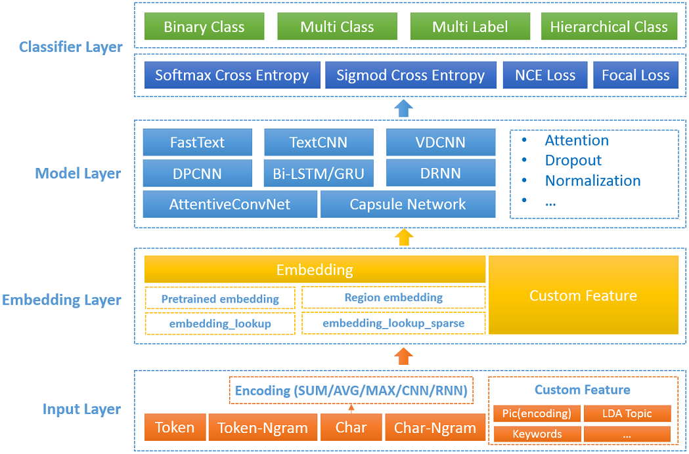
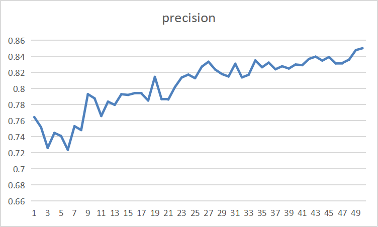
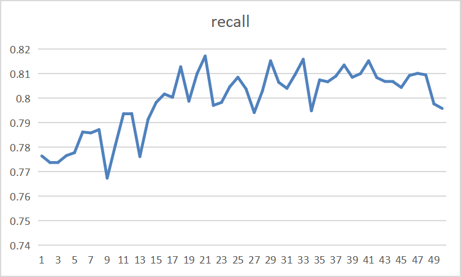
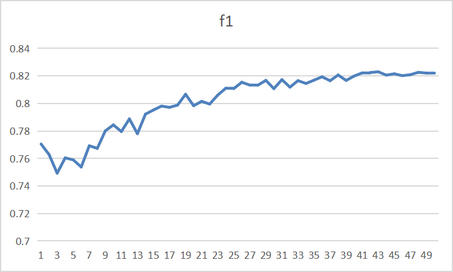

-   [基本信息](#基本信息.md)
-   [概述](#概述.md)
-   [训练环境准备](#训练环境准备.md)
-   [快速上手](#快速上手.md)
-   [高级参考](#高级参考.md)
<h2 id="基本信息.md">基本信息</h2>

**发布者（Publisher）：Huawei**

**应用领域（Application Domain）：** 文本分类

**版本（Version）：1.1**

**修改时间（Modified） ：2023.1.5**

**框架（Framework）：TensorFlow 1.15.0**

**模型格式（Model Format）：ckpt**

**处理器（Processor）：昇腾910**

**应用级别（Categories）：Research**

**描述（Description）：基于TensorFlow框架的文本分类工具** 

<h2 id="概述.md">概述</h2>

DeepText-NeuralClassifier 是一个深度学习文本分类工具。它将深度学习文本分类模型和机制等集成到一个统一的框架中，使用TensorFlow的High-level API进行开发，可以方便灵活集成更多的模型或方法。DeepText-NeuralClassifier的框架可以抽象为输入层、Embedding层、模型层、分类层四层，具体结构如下：


- 参考实现
  https://github.com/ZouJoshua/deeptext_project    

- 适配昇腾 AI 处理器的实现：
    
  https://gitee.com/ascend/ModelZoo-TensorFlow/tree/master/TensorFlow/contrib/nlp/DeepText-NeuralClassifier


## 默认配置<a name="section91661242121611"></a>

- 数据集预处理：

  数据格式（四列）：

  ```txt
  label\t[(token )+]\t[(char )+]\t[(custom_feature )+]
  label：分类的标签，可以是层次的：cate1--cate2--cate3
  token：中文词，对应英文的单词，不需要id化
  char：中文字，对应英文的字符，不需要id化
  custom_feature：自定义，当前支持离散型特征
  说明：label必须有，token, char, custom_feature至少提供一个，没有的需要留空
  ```

在训练前会将数据生成为TFRecord格式，通常生成一次TFRecord后可以提供给多个模型使用 ，除非更改数据处理相关的配置。

数据文件默认统一采用UTF-8编码，修改请参照util.CHARSET。

- 默认训练超参
  - Batch size: 64
  - Learning rate(lr): 0.005
  - Optimizer: Adam
  - train_epochs: 50
  - decay_rate: 0.95
  - 其余参数从 conf/textcnn_char.config 中加载


## 支持特性<a name="section1899153513554"></a>

| 特性列表  | 是否支持 |
|-------|------|
| 混合精度  | 是    |

## 混合精度训练<a name="section168064817164"></a>

昇腾910 AI处理器提供自动混合精度功能，可以针对全网中float32数据类型的算子，按照内置的优化策略，自动将部分float32的算子降低精度到float16，从而在精度损失很小的情况下提升系统性能并减少内存使用。

## 开启混合精度<a name="section20779114113713"></a>

脚本已默认开启混合精度。

<h2 id="训练环境准备.md">训练环境准备</h2>

1.  硬件环境准备请参见各硬件产品文档"[驱动和固件安装升级指南]( https://support.huawei.com/enterprise/zh/category/ai-computing-platform-pid-1557196528909)"。需要在硬件设备上安装与CANN版本配套的固件与驱动。
2.  宿主机上需要安装Docker并登录[Ascend Hub中心](https://ascendhub.huawei.com/#/detail?name=ascend-tensorflow-arm)获取镜像。

    当前模型支持的镜像列表如[表1](#zh-cn_topic_0000001074498056_table1519011227314)所示。

    **表 1** 镜像列表

    <a name="zh-cn_topic_0000001074498056_table1519011227314"></a>
    <table><thead align="left"><tr id="zh-cn_topic_0000001074498056_row0190152218319"><th class="cellrowborder" valign="top" width="47.32%" id="mcps1.2.4.1.1"><p id="zh-cn_topic_0000001074498056_p1419132211315"><a name="zh-cn_topic_0000001074498056_p1419132211315"></a><a name="zh-cn_topic_0000001074498056_p1419132211315"></a><em id="i1522884921219"><a name="i1522884921219"></a><a name="i1522884921219"></a>镜像名称</em></p>
    </th>
    <th class="cellrowborder" valign="top" width="25.52%" id="mcps1.2.4.1.2"><p id="zh-cn_topic_0000001074498056_p75071327115313"><a name="zh-cn_topic_0000001074498056_p75071327115313"></a><a name="zh-cn_topic_0000001074498056_p75071327115313"></a><em id="i1522994919122"><a name="i1522994919122"></a><a name="i1522994919122"></a>镜像版本</em></p>
    </th>
    <th class="cellrowborder" valign="top" width="27.16%" id="mcps1.2.4.1.3"><p id="zh-cn_topic_0000001074498056_p1024411406234"><a name="zh-cn_topic_0000001074498056_p1024411406234"></a><a name="zh-cn_topic_0000001074498056_p1024411406234"></a><em id="i723012493123"><a name="i723012493123"></a><a name="i723012493123"></a>配套CANN版本</em></p>
    </th>
    </tr>
    </thead>
    <tbody><tr id="zh-cn_topic_0000001074498056_row71915221134"><td class="cellrowborder" valign="top" width="47.32%" headers="mcps1.2.4.1.1 "><a name="zh-cn_topic_0000001074498056_ul81691515131910"></a><a name="zh-cn_topic_0000001074498056_ul81691515131910"></a><ul id="zh-cn_topic_0000001074498056_ul81691515131910"><li><em id="i82326495129"><a name="i82326495129"></a><a name="i82326495129"></a>ARM架构：<a href="https://ascend.huawei.com/ascendhub/#/detail?name=ascend-tensorflow-arm" target="_blank" rel="noopener noreferrer">ascend-tensorflow-arm</a></em></li><li><em id="i18233184918125"><a name="i18233184918125"></a><a name="i18233184918125"></a>x86架构：<a href="https://ascend.huawei.com/ascendhub/#/detail?name=ascend-tensorflow-x86" target="_blank" rel="noopener noreferrer">ascend-tensorflow-x86</a></em></li></ul>
    </td>
    <td class="cellrowborder" valign="top" width="25.52%" headers="mcps1.2.4.1.2 "><p id="zh-cn_topic_0000001074498056_p1450714271532"><a name="zh-cn_topic_0000001074498056_p1450714271532"></a><a name="zh-cn_topic_0000001074498056_p1450714271532"></a><em id="i72359495125"><a name="i72359495125"></a><a name="i72359495125"></a>21.0.2</em></p>
    </td>
    <td class="cellrowborder" valign="top" width="27.16%" headers="mcps1.2.4.1.3 "><p id="zh-cn_topic_0000001074498056_p18244640152312"><a name="zh-cn_topic_0000001074498056_p18244640152312"></a><a name="zh-cn_topic_0000001074498056_p18244640152312"></a><em id="i162363492129"><a name="i162363492129"></a><a name="i162363492129"></a><a href="https://support.huawei.com/enterprise/zh/ascend-computing/cann-pid-251168373/software" target="_blank" rel="noopener noreferrer">21.0.2</a></em></p>
    </td>
    </tr>
    </tbody>
    </table>


<h2 id="快速上手.md">快速上手</h2>

- 数据集准备

  [下载](https://github.com/ZouJoshua/deeptext_project/tree/master/data) train.txt文件放入data目录下

  thuc_news数据集，共10个类别的文本分类任务，类别如下：

  ```
  体育, 财经, 房产, 家居, 教育, 科技, 时尚, 时政, 游戏, 娱乐
  ```

  也可按照给定的格式处理其他数据进行训练和测试。
   

## 模型训练<a name="section715881518135"></a>

- 单卡训练

  执行 `bash test/train_full_1p.sh` 开始训练。

  > 若之前进行过训练，请将checkpoint以及导出的模型删除，避免多次训练重叠。


<h2 id="高级参考.md">高级参考</h2>


## 训练过程<a name="section1589455252218"></a>

1.  通过“模型训练”中的指令启动单卡训练。

2.  训练过程中，每100个 step 会打印出当前的 loss 值以及消耗的时间。每个 epoch 训练结 束后会进行测试，打印出对应的 precision，recall 以及 f1 值，并记录下最好的结果。

## 训练结果<a name="section1465595372416"></a>

### NPU 网络训练精度

```txt
precision: 0.839792, recall: 0.806885, f1: 0.823009,standard: 8192
```








### NPU/GPU 网络训练性能 
| NPU  | GPU |
|-------|------|
| 22ms/step| 23ms/step|
```
其中GPU为v100
训练过程中打印的是100个step的用时
```
## 综合评价
NPU上训练后的精度与GPU基本一致。
就每个step的用时来看，NPU的性能优于GPU。

